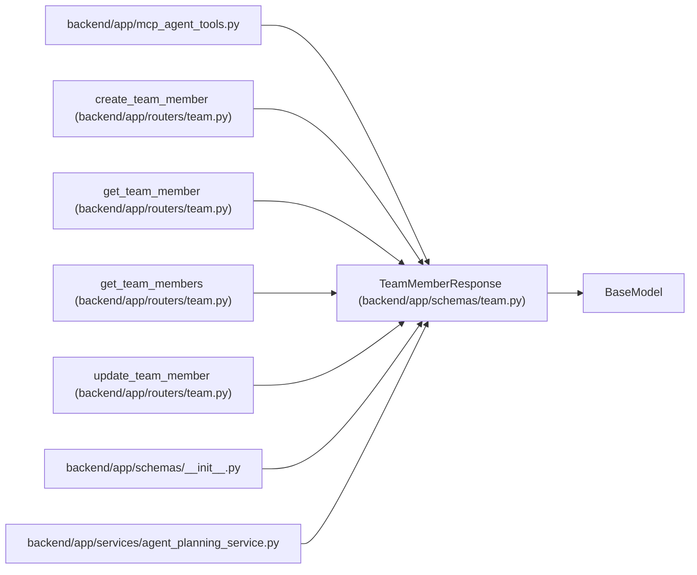

# TeamMemberResponse

**Location:** `backend/app/schemas/team.py:276`
**Kind:** Pydantic model
**Bases:** `BaseModel`
**Module:** [schemas_team](../modules/schemas_team.md)

## Description

Schema for team member response.

## Model Configuration

| Setting | Value | Source |
|---------|-------|--------|
| `from_attributes` | `True` | config_class |

## Attributes

| Name | Type | Wire name | Required | Nullable | Default | Constraints | Examples | Description |
|------|------|-----------|----------|----------|---------|-------------|-------------|----------|
| `id` | `int` | `id` | Yes | No | — | — | — | — |
| `iteration_id` | `Optional[int]` | `iteration_id` | No | Yes | `None` | — | — | — |
| `profile_id` | `Optional[int]` | `profile_id` | No | Yes | `None` | — | — | — |
| `name` | `str` | `name` | Yes | No | — | — | — | — |
| `position` | `str` | `position` | Yes | No | — | — | — | — |
| `email` | `Optional[str]` | `email` | No | Yes | `None` | — | — | — |
| `availability_percent` | `float` | `availability_percent` | Yes | No | — | — | — | — |
| `professionalism_coefficient` | `float` | `professionalism_coefficient` | Yes | No | — | — | — | — |
| `operational_utilization` | `float` | `operational_utilization` | Yes | No | — | — | — | — |
| `profile` | `Optional[TeamMemberProfileCompact]` | `profile` | No | Yes | `None` | — | — | — |
| `vacations` | `list[VacationResponse]` | `vacations` | No | No | `[]` | — | — | — |

## Methods

*No public methods. Inherits from base classes.*

## Relationships

<!-- Auto-generated relationship summary. Do not edit by hand. -->

### Summary

| Module | Methods | Attributes |
|---|---:|---|
| [schemas_team](../modules/schemas_team.md) | 0 | `availability_percent`, `email`, `id`, `iteration_id`, `name`, `operational_utilization`, `position`, `professionalism_coefficient`, `profile`, `profile_id`, `vacations` |

### Structure

| Kind | Entity | Module |
|---|---|---|
| Base | `BaseModel` | — |

### References

| Reference | Kind | Source | Call sites |
|---|---|---|---:|
| `mcp_agent_tools` | import | [mcp_agent_tools](../modules/mcp_agent_tools.md) | — |
| `create_team_member` | type_reference | [routers_team](../modules/routers_team.md) | — |
| `get_team_member` | type_reference | [routers_team](../modules/routers_team.md) | — |
| `get_team_members` | type_reference | [routers_team](../modules/routers_team.md) | — |
| `update_team_member` | type_reference | [routers_team](../modules/routers_team.md) | — |
| `__init__` | import | [schemas___init__](../modules/schemas___init__.md) | — |
| `agent_planning_service` | import | [agent_planning_service](../modules/agent_planning_service.md) | — |
