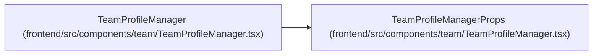

# TeamProfileManagerProps

**Location:** `frontend/src/components/team/TeamProfileManager.tsx:64`
**Kind:** Class
**Bases:** —
**Module:** [TeamProfileManager](../modules/TeamProfileManager.md)

## Description

_Auto-generated from `TeamProfileManagerProps` in `frontend/src/components/team/TeamProfileManager.tsx`._

## Attributes

| Name | Type | Required | Default | Description |
|------|------|----------|---------|-------------|
| `currentIterationId` | `number \| null` | No | — | — |
| `currentIterationName` | `string \| null` | No | — | — |
| `assignedProfileIds` | `number[]` | No | — | — |
| `onAssignProfile` | `(profile: TeamMemberProfile) => void` | No | — | — |

## Methods

*No public methods. Inherits from base classes.*

## Relationships

<!-- Auto-generated relationship summary. Do not edit by hand. -->

### Summary

| Module | Methods | Attributes |
|---|---:|---|
| [TeamProfileManager](../modules/TeamProfileManager.md) | 0 | `assignedProfileIds`, `currentIterationId`, `currentIterationName`, `onAssignProfile` |

### References

| Reference | Kind | Source | Call sites |
|---|---|---|---:|
| `TeamProfileManager` | type_reference | [TeamProfileManager](../modules/TeamProfileManager.md) | — |
