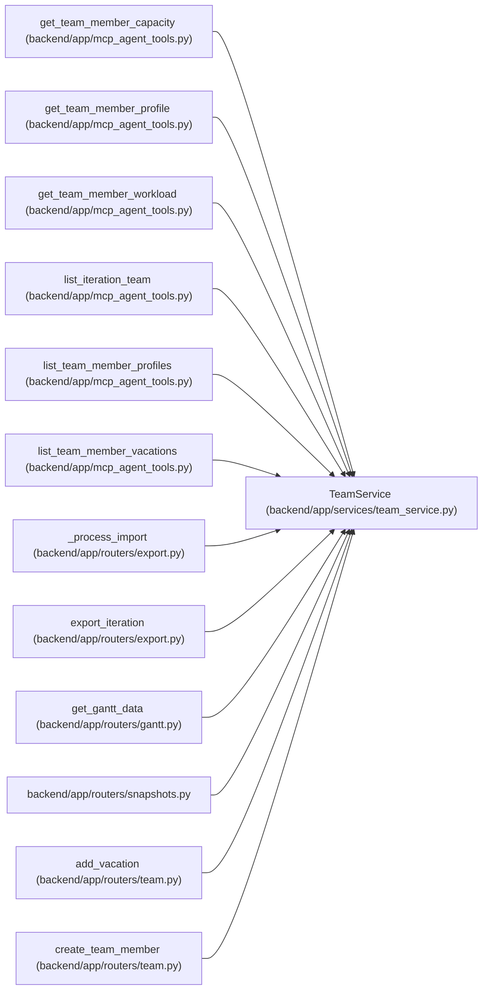

# TeamService

**Location:** `backend/app/services/team_service.py:36`
**Kind:** Class
**Bases:** —
**Module:** [team_service](../modules/team_service.md)

## Description

Service for team member operations.

## Attributes

*No annotated attributes found.*

## Methods

| Method | Signature | Decorators | Description |
|--------|-----------|------------|-------------|
| `__init__` | `(db: AsyncSession)` | — | — |
| `_profile_options` | `()` | — | Return eager loading options for reusable profile responses. |
| `_member_options` | `()` | — | Return eager loading options for team member responses. |
| `_normalize_text_key` | `(value: str \| None) -> str` | — | Return a lowercase matching key for display names and emails. |
| `_get_profile_by_id` | *(async)* `(profile_id: int) -> TeamMemberProfile \| None` | — | Load a reusable profile by id. |
| `_require_profile_not_assigned_to_iteration` | *(async)* `(profile_id: int, iteration_id: int \| None, *, exclude_member_id: int \| None = None) -> None` | — | Ensure a profile has at most one capacity row in an iteration. |
| `_resolve_profile_for_member` | *(async)* `(*, name: str, email: str \| None, profile_id: int \| None, create_if_missing: bool = True) -> TeamMemberProfile \| None` | — | Resolve explicit or inferred reusable profile for a team member. |
| `list_profiles` | *(async)* `() -> Sequence[TeamMemberProfile]` | — | List reusable capability profiles. |
| `get_profile` | *(async)* `(profile_id: int) -> TeamMemberProfile \| None` | — | Get a reusable capability profile by id. |
| `create_profile` | *(async)* `(data: TeamMemberProfileCreate, *, commit: bool = True) -> TeamMemberProfile` | — | Create a profile, optionally leaving commit ownership to the caller. |
| `update_profile` | *(async)* `(profile_id: int, data: TeamMemberProfileUpdate, *, commit: bool = True) -> TeamMemberProfile \| None` | `@schedule_input_command('profile')` | Update profile metadata, optionally deferring the commit. |
| `delete_profile` | *(async)* `(profile_id: int) -> bool` | `@schedule_input_command('profile')` | Delete a reusable profile and detach linked team members. |
| `add_profile_skill` | *(async)* `(profile_id: int, data: TeamMemberProfileSkillCreate) -> TeamMemberProfileSkill \| None` | `@schedule_input_command('profile')` | Add a skill or weakness to a profile. |
| `update_profile_skill` | *(async)* `(profile_id: int, skill_id: int, data: TeamMemberProfileSkillUpdate) -> TeamMemberProfileSkill \| None` | `@schedule_input_command('profile')` | Update a profile skill or weakness. |
| `delete_profile_skill` | *(async)* `(profile_id: int, skill_id: int) -> bool` | `@schedule_input_command('profile')` | Delete one profile skill or weakness. |
| `get_by_iteration` | *(async)* `(iteration_id: int) -> Sequence[TeamMember]` | — | Get all team members for an iteration. |
| `get_all_unique_members` | *(async)* `() -> list[dict]` | — | Get unique members by name across all iterations (for reuse). |
| `list_member_options` | *(async)* `() -> list[TeamMemberOptionResponse]` | — | List all team members with enough context for owner selectors. |
| `get_by_id` | *(async)* `(member_id: int, *, load_tasks: bool = True) -> TeamMember \| None` | — | Get team member by ID. |
| `create` | *(async)* `(iteration_id: int, data: TeamMemberCreate, *, commit: bool = True) -> TeamMember` | `@schedule_input_command('member')` | Create a team member, optionally leaving commit ownership to the caller. |
| `update` | *(async)* `(member_id: int, data: TeamMemberUpdate, *, commit: bool = True) -> TeamMember \| None` | `@schedule_input_command('member')` | Update a team member, optionally leaving commit ownership to the caller. |
| `detach_absence_adapters` | *(async)* `(member, next_profile_id)` | — | Allocation identity changes must not expose another person's absence adapters. |
| `delete` | *(async)* `(member_id: int) -> bool` | `@schedule_input_command('member')` | Delete a team member. |
| `add_vacation` | *(async)* `(member_id: int, data: VacationCreate, *, commit: bool = True) -> Vacation \| None` | `@schedule_input_command('member')` | Add a vacation, optionally leaving commit ownership to the caller. |
| `update_vacation` | *(async)* `(vacation_id: int, data: VacationUpdate, *, commit: bool = True) -> Vacation \| None` | `@schedule_input_command('member')` | Update a vacation period, optionally leaving commit ownership to the caller. |
| `delete_vacation` | *(async)* `(vacation_id: int) -> bool` | `@schedule_input_command('member')` | Delete a vacation. |
| `import_vacations` | *(async)* `(iteration_id: int, csv_text: str) -> VacationImportResponse` | `@schedule_input_command('member')` | Import vacation ranges for iteration team members from CSV text. |
| `calculate_capacity` | *(async)* `(member_id: int) -> MemberCapacity \| None` | — | Calculate capacity for a team member. |
| `get_workload` | *(async)* `(member_id: int) -> MemberWorkload \| None` | — | Get workload information for a team member. |
| `import_members` | *(async)* `(iteration_id: int, text: str, *, expected_revisions: dict[int, int] \| None = None) -> list[TeamMember]` | `@schedule_input_command('member')` | Import multiple team members from text format. |

## Relationships

<!-- Auto-generated relationship summary. Do not edit by hand. -->

### Summary

| Module | Methods | Attributes |
|---|---:|---|
| [team_service](../modules/team_service.md) | 30 | — |

### References

| Reference | Kind | Source | Call sites |
|---|---|---|---:|
| `get_team_member_capacity` | call | [mcp_agent_tools](../modules/mcp_agent_tools.md) | 1 |
| `get_team_member_profile` | call | [mcp_agent_tools](../modules/mcp_agent_tools.md) | 1 |
| `get_team_member_workload` | call | [mcp_agent_tools](../modules/mcp_agent_tools.md) | 1 |
| `list_iteration_team` | call | [mcp_agent_tools](../modules/mcp_agent_tools.md) | 1 |
| `list_team_member_profiles` | call | [mcp_agent_tools](../modules/mcp_agent_tools.md) | 1 |
| `list_team_member_vacations` | call | [mcp_agent_tools](../modules/mcp_agent_tools.md) | 1 |
| `_process_import` | call | [export](../modules/export.md) | 1 |
| `export_iteration` | call | [export](../modules/export.md) | 1 |
| `get_gantt_data` | call | [routers_gantt](../modules/routers_gantt.md) | 1 |
| `snapshots` | import | [snapshots](../modules/snapshots.md) | — |
| `add_vacation` | type_reference | [routers_team](../modules/routers_team.md) | — |
| `create_team_member` | type_reference | [routers_team](../modules/routers_team.md) | — |

> References: showing 12 of 56 logical references; 44 omitted by the 12-row generated summary limit.
