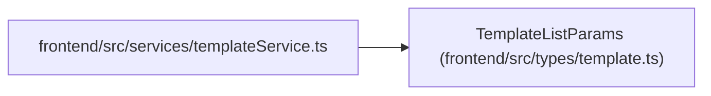

# TemplateListParams

**Location:** `frontend/src/types/template.ts:39`
**Kind:** Class
**Bases:** —
**Module:** [types_template](../modules/types_template.md)

## Description

_Auto-generated from `TemplateListParams` in `frontend/src/types/template.ts`._

## Attributes

| Name | Type | Default | Description |
|------|------|---------|-------------|
| `template_type` | `TemplateType` | *required* | — |
| `include_inactive` | `boolean` | *required* | — |

## Methods

*No public methods. Inherits from base classes.*

## Relationships

<!-- Auto-generated relationship summary. Do not edit by hand. -->

### Summary

| Module | Methods | Attributes |
|---|---:|---|
| [types_template](../modules/types_template.md) | 0 | `include_inactive`, `template_type` |

### References

| Reference | Kind | Source | Call sites |
|---|---|---|---:|
| `templateService` | import | [templateService](../modules/templateService.md) | — |
