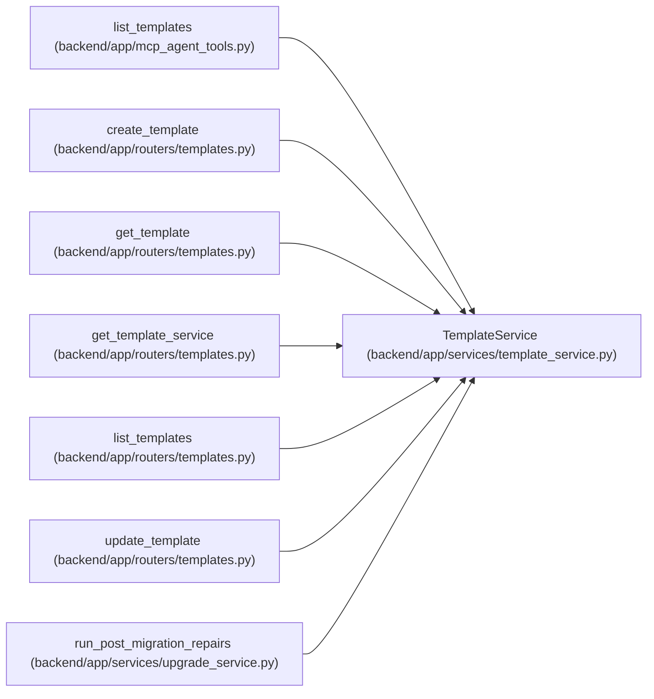

# TemplateService

**Location:** `backend/app/services/template_service.py:159`
**Kind:** Class
**Bases:** —
**Module:** [template_service](../modules/template_service.md)

## Description

Service for template CRUD and built-in template seeding.

## Attributes

*No annotated attributes found.*

## Methods

| Method | Signature | Decorators | Description |
|--------|-----------|------------|-------------|
| `__init__` | `(db: AsyncSession)` | — | — |
| `_enum_value` | `(value)` | — | Normalize Pydantic enum values before assigning to string columns. |
| `_query` | `() -> Select` | — | Build the base template query. |
| `seed_default_templates` | *(async)* `() -> list[WorkTemplate]` | — | Insert missing built-ins and safely upgrade unchanged legacy defaults. |
| `list_templates` | *(async)* `(template_type: Optional[TemplateType \| str] = None, include_inactive: bool = False) -> Sequence[WorkTemplate]` | — | List templates ordered for create-form selection. |
| `get_by_id` | *(async)* `(template_id: int) -> Optional[WorkTemplate]` | — | Get a template by ID. |
| `create` | *(async)* `(data: WorkTemplateCreate) -> WorkTemplate` | — | Create a user-managed template. |
| `update` | *(async)* `(template_id: int, data: WorkTemplateUpdate) -> Optional[WorkTemplate]` | — | Apply a partial template update. |

## Relationships

<!-- Auto-generated relationship summary. Do not edit by hand. -->

### Summary

| Module | Methods | Attributes |
|---|---:|---|
| [template_service](../modules/template_service.md) | 8 | — |

### References

| Reference | Kind | Source | Call sites |
|---|---|---|---:|
| `list_templates` | call | [mcp_agent_tools](../modules/mcp_agent_tools.md) | 1 |
| `create_template` | type_reference | [templates](../modules/templates.md) | — |
| `get_template` | type_reference | [templates](../modules/templates.md) | — |
| `get_template_service` | call | [templates](../modules/templates.md) | 1 |
| `get_template_service` | type_reference | [templates](../modules/templates.md) | — |
| `list_templates` | type_reference | [templates](../modules/templates.md) | — |
| `update_template` | type_reference | [templates](../modules/templates.md) | — |
| `run_post_migration_repairs` | call | [upgrade_service](../modules/upgrade_service.md) | 1 |
