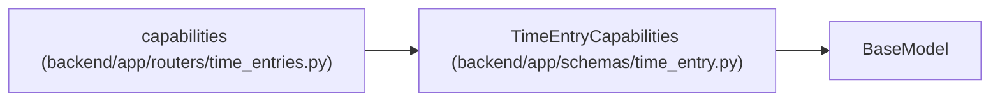

# TimeEntryCapabilities

**Location:** `backend/app/schemas/time_entry.py:98`
**Kind:** Pydantic model
**Bases:** `BaseModel`
**Module:** [schemas_time_entry](../modules/schemas_time_entry.md)

## Description

_Auto-generated from `TimeEntryCapabilities` in `backend/app/schemas/time_entry.py`._

## Attributes

| Name | Type | Wire name | Required | Nullable | Default | Constraints | Examples | Description |
|------|------|-----------|----------|----------|---------|-------------|-------------|----------|
| `schema_version` | `Literal[1]` | `schema_version` | No | No | `1` | — | — | — |
| `enabled` | `bool` | `enabled` | Yes | No | — | — | — | — |
| `human_identity_required` | `bool` | `human_identity_required` | Yes | No | — | — | — | — |
| `units` | `Literal['whole_minutes']` | `units` | No | No | `'whole_minutes'` | — | — | — |
| `privacy` | `Literal['private_entries_manager_totals']` | `privacy` | No | No | `'private_entries_manager_totals'` | — | — | — |

## Methods

*No public methods. Inherits from base classes.*

## Relationships

<!-- Auto-generated relationship summary. Do not edit by hand. -->

### Summary

| Module | Methods | Attributes |
|---|---:|---|
| [schemas_time_entry](../modules/schemas_time_entry.md) | 0 | `enabled`, `human_identity_required`, `privacy`, `schema_version`, `units` |

### Structure

| Kind | Entity | Module |
|---|---|---|
| Base | `BaseModel` | — |

### References

| Reference | Kind | Source | Call sites |
|---|---|---|---:|
| `capabilities` | type_reference | [time_entries](../modules/time_entries.md) | — |
