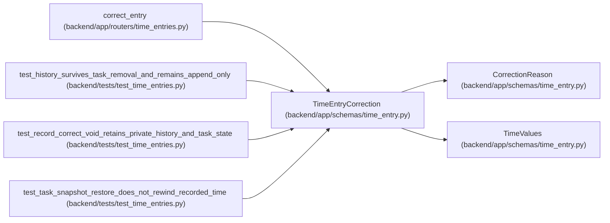

# TimeEntryCorrection

**Location:** `backend/app/schemas/time_entry.py:56`
**Kind:** Pydantic model
**Bases:** `TimeValues`, `CorrectionReason`
**Module:** [schemas_time_entry](../modules/schemas_time_entry.md)

## Description

_Auto-generated from `TimeEntryCorrection` in `backend/app/schemas/time_entry.py`._

## Attributes

| Name | Type | Wire name | Required | Nullable | Default | Constraints | Examples | Description |
|------|------|-----------|----------|----------|---------|-------------|-------------|----------|
| `expected_version` | `StrictInt` | `expected_version` | Yes | No | — | ge=1 | — | — |

## Methods

*No public methods. Inherits from base classes.*

## Relationships

<!-- Auto-generated relationship summary. Do not edit by hand. -->

### Summary

| Module | Methods | Attributes |
|---|---:|---|
| [schemas_time_entry](../modules/schemas_time_entry.md) | 0 | `expected_version` |

### Structure

| Kind | Entity | Module |
|---|---|---|
| Base | `CorrectionReason` | [schemas_time_entry](../modules/schemas_time_entry.md) |
| Base | `TimeValues` | [schemas_time_entry](../modules/schemas_time_entry.md) |

### References

| Reference | Kind | Source | Call sites |
|---|---|---|---:|
| `correct_entry` | type_reference | [time_entries](../modules/time_entries.md) | — |
| `test_history_survives_task_removal_and_remains_append_only` | call | [test_time_entries](../modules/test_time_entries.md) | 1 |
| `test_record_correct_void_retains_private_history_and_task_state` | call | [test_time_entries](../modules/test_time_entries.md) | 1 |
| `test_task_snapshot_restore_does_not_rewind_recorded_time` | call | [test_time_entries](../modules/test_time_entries.md) | 1 |
