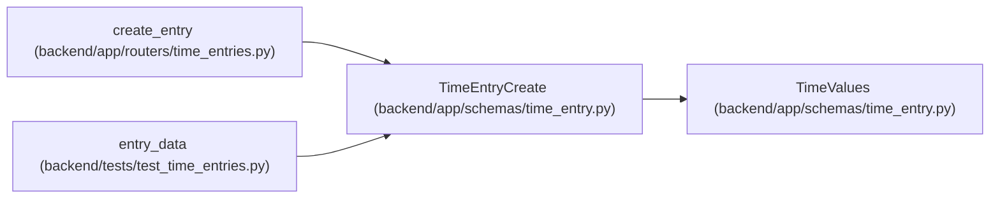

# TimeEntryCreate

**Location:** `backend/app/schemas/time_entry.py:38`
**Kind:** Pydantic model
**Bases:** `TimeValues`
**Module:** [schemas_time_entry](../modules/schemas_time_entry.md)

## Description

_Auto-generated from `TimeEntryCreate` in `backend/app/schemas/time_entry.py`._

## Attributes

| Name | Type | Wire name | Required | Nullable | Default | Constraints | Examples | Description |
|------|------|-----------|----------|----------|---------|-------------|-------------|----------|
| `project_id` | `StrictInt` | `project_id` | Yes | No | — | ge=1 | — | — |
| `task_id` | `StrictInt \| None` | `task_id` | No | Yes | `None` | ge=1 | — | — |
| `request_id` | `UUID` | `request_id` | Yes | No | — | — | — | — |

## Methods

*No public methods. Inherits from base classes.*

## Relationships

<!-- Auto-generated relationship summary. Do not edit by hand. -->

### Summary

| Module | Methods | Attributes |
|---|---:|---|
| [schemas_time_entry](../modules/schemas_time_entry.md) | 0 | `project_id`, `request_id`, `task_id` |

### Structure

| Kind | Entity | Module |
|---|---|---|
| Base | `TimeValues` | [schemas_time_entry](../modules/schemas_time_entry.md) |

### References

| Reference | Kind | Source | Call sites |
|---|---|---|---:|
| `create_entry` | type_reference | [time_entries](../modules/time_entries.md) | — |
| `entry_data` | call | [test_time_entries](../modules/test_time_entries.md) | 1 |
