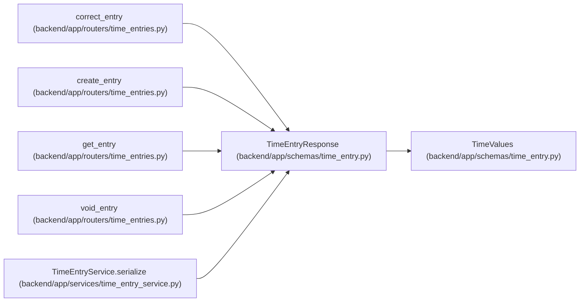

# TimeEntryResponse

**Location:** `backend/app/schemas/time_entry.py:64`
**Kind:** Pydantic model
**Bases:** `TimeValues`
**Module:** [schemas_time_entry](../modules/schemas_time_entry.md)

## Description

_Auto-generated from `TimeEntryResponse` in `backend/app/schemas/time_entry.py`._

## Attributes

| Name | Type | Wire name | Required | Nullable | Default | Constraints | Examples | Description |
|------|------|-----------|----------|----------|---------|-------------|-------------|----------|
| `id` | `int` | `id` | Yes | No | — | — | — | — |
| `project_id` | `int` | `project_id` | Yes | No | — | — | — | — |
| `task_id` | `int \| None` | `task_id` | Yes | Yes | — | — | — | — |
| `task_title` | `str \| None` | `task_title` | Yes | Yes | — | — | — | — |
| `principal_id` | `int` | `principal_id` | Yes | No | — | — | — | — |
| `version` | `int` | `version` | Yes | No | — | — | — | — |
| `voided` | `bool` | `voided` | Yes | No | — | — | — | — |
| `created_at` | `datetime` | `created_at` | Yes | No | — | — | — | — |
| `updated_at` | `datetime` | `updated_at` | Yes | No | — | — | — | — |

## Methods

*No public methods. Inherits from base classes.*

## Relationships

<!-- Auto-generated relationship summary. Do not edit by hand. -->

### Summary

| Module | Methods | Attributes |
|---|---:|---|
| [schemas_time_entry](../modules/schemas_time_entry.md) | 0 | `created_at`, `id`, `principal_id`, `project_id`, `task_id`, `task_title`, `updated_at`, `version`, `voided` |

### Structure

| Kind | Entity | Module |
|---|---|---|
| Base | `TimeValues` | [schemas_time_entry](../modules/schemas_time_entry.md) |

### References

| Reference | Kind | Source | Call sites |
|---|---|---|---:|
| `correct_entry` | type_reference | [time_entries](../modules/time_entries.md) | — |
| `create_entry` | type_reference | [time_entries](../modules/time_entries.md) | — |
| `get_entry` | type_reference | [time_entries](../modules/time_entries.md) | — |
| `void_entry` | type_reference | [time_entries](../modules/time_entries.md) | — |
| `TimeEntryService.serialize` | call | [time_entry_service](../modules/time_entry_service.md) | 1 |
