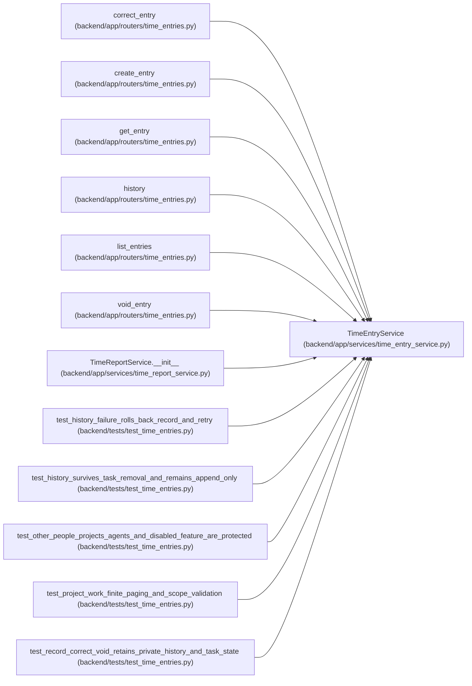

# TimeEntryService

**Location:** `backend/app/services/time_entry_service.py:29`
**Kind:** Class
**Bases:** —
**Module:** [time_entry_service](../modules/time_entry_service.md)

## Description

_Auto-generated from `TimeEntryService` in `backend/app/services/time_entry_service.py`._

## Attributes

*No annotated attributes found.*

## Methods

| Method | Signature | Decorators | Description |
|--------|-----------|------------|-------------|
| `__init__` | `(db)` | — | — |
| `principal_id` | `()` | — | — |
| `project` | *(async)* `(project_id, *, writing = False)` | — | — |
| `lock_author` | *(async)* `()` | — | — |
| `authorize_object` | `(obj)` | — | — |
| `serialize` | `(entry)` | `@staticmethod` | — |
| `get` | *(async)* `(entry_id)` | — | — |
| `check_window` | `(start, end)` | `@staticmethod` | — |
| `list` | *(async)* `(*, project_id = None, task_id = None, start = None, end = None, after_id = 0, upper_id = None, limit = 50, include_voided = False)` | — | — |
| `check_day_total` | *(async)* `(principal_id, work_date, minutes, *, exclude_id = None)` | — | — |
| `append_revision` | *(async)* `(entry, reason)` | — | — |
| `create` | *(async)* `(data)` | `@atomic_command` | — |
| `correct` | *(async)* `(entry_id, data, *, void = False)` | `@atomic_command` | — |
| `history` | *(async)* `(entry_id, *, after_version = 0, limit = 50)` | — | — |

## Relationships

<!-- Auto-generated relationship summary. Do not edit by hand. -->

### Summary

| Module | Methods | Attributes |
|---|---:|---|
| [time_entry_service](../modules/time_entry_service.md) | 14 | — |

### References

| Reference | Kind | Source | Call sites |
|---|---|---|---:|
| `correct_entry` | call | [time_entries](../modules/time_entries.md) | 1 |
| `create_entry` | call | [time_entries](../modules/time_entries.md) | 1 |
| `get_entry` | call | [time_entries](../modules/time_entries.md) | 1 |
| `history` | call | [time_entries](../modules/time_entries.md) | 1 |
| `list_entries` | call | [time_entries](../modules/time_entries.md) | 1 |
| `void_entry` | call | [time_entries](../modules/time_entries.md) | 1 |
| `TimeReportService.__init__` | call | [time_report_service](../modules/time_report_service.md) | 1 |
| `test_history_failure_rolls_back_record_and_retry` | call | [test_time_entries](../modules/test_time_entries.md) | 1 |
| `test_history_survives_task_removal_and_remains_append_only` | call | [test_time_entries](../modules/test_time_entries.md) | 1 |
| `test_other_people_projects_agents_and_disabled_feature_are_protected` | call | [test_time_entries](../modules/test_time_entries.md) | 1 |
| `test_project_work_finite_paging_and_scope_validation` | call | [test_time_entries](../modules/test_time_entries.md) | 1 |
| `test_record_correct_void_retains_private_history_and_task_state` | call | [test_time_entries](../modules/test_time_entries.md) | 1 |

> References: showing 12 of 17 logical references; 5 omitted by the 12-row generated summary limit.
