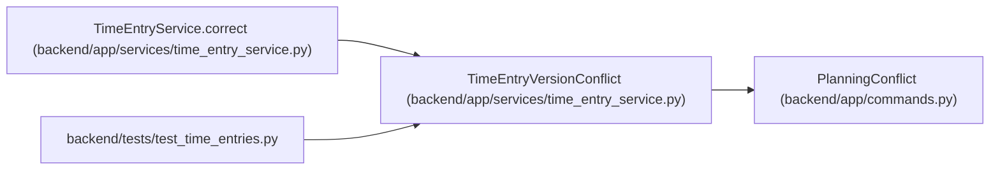

# TimeEntryVersionConflict

**Location:** `backend/app/services/time_entry_service.py:20`
**Kind:** Class
**Bases:** `PlanningConflict`
**Module:** [time_entry_service](../modules/time_entry_service.md)

## Description

_Auto-generated from `TimeEntryVersionConflict` in `backend/app/services/time_entry_service.py`._

## Attributes

*No annotated attributes found.*

## Methods

| Method | Signature | Decorators | Description |
|--------|-----------|------------|-------------|
| `__init__` | `(expected, entry)` | — | — |
| `detail` | `()` | — | — |

## Relationships

<!-- Auto-generated relationship summary. Do not edit by hand. -->

### Summary

| Module | Methods | Attributes |
|---|---:|---|
| [time_entry_service](../modules/time_entry_service.md) | 2 | — |

### Structure

| Kind | Entity | Module |
|---|---|---|
| Base | `PlanningConflict` | [commands](../modules/commands.md) |

### References

| Reference | Kind | Source | Call sites |
|---|---|---|---:|
| `TimeEntryService.correct` | call | [time_entry_service](../modules/time_entry_service.md) | 1 |
| `test_time_entries` | import | [test_time_entries](../modules/test_time_entries.md) | — |
