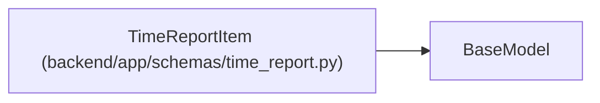

# TimeReportItem

**Location:** `backend/app/schemas/time_report.py:8`
**Kind:** Pydantic model
**Bases:** `BaseModel`
**Module:** [time_report](../modules/time_report.md)

## Description

_Auto-generated from `TimeReportItem` in `backend/app/schemas/time_report.py`._

## Attributes

| Name | Type | Wire name | Required | Nullable | Default | Constraints | Examples | Description |
|------|------|-----------|----------|----------|---------|-------------|-------------|----------|
| `task_id` | `int` | `task_id` | Yes | No | — | — | — | — |
| `task_title` | `str \| None` | `task_title` | Yes | Yes | — | — | — | — |
| `recorded_minutes` | `int \| None` | `recorded_minutes` | Yes | Yes | — | — | — | — |
| `entry_count` | `int` | `entry_count` | Yes | No | — | — | — | — |
| `estimate_hours` | `float \| None` | `estimate_hours` | Yes | Yes | — | — | — | — |
| `estimate_state` | `Literal['known', 'unknown', 'unavailable']` | `estimate_state` | Yes | No | — | — | — | — |

## Methods

*No public methods. Inherits from base classes.*

## Relationships

<!-- Auto-generated relationship summary. Do not edit by hand. -->

### Summary

| Module | Methods | Attributes |
|---|---:|---|
| [time_report](../modules/time_report.md) | 0 | `entry_count`, `estimate_hours`, `estimate_state`, `recorded_minutes`, `task_id`, `task_title` |

### Structure

| Kind | Entity | Module |
|---|---|---|
| Base | `BaseModel` | — |
