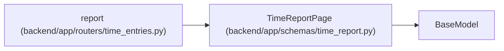

# TimeReportPage

**Location:** `backend/app/schemas/time_report.py:26`
**Kind:** Pydantic model
**Bases:** `BaseModel`
**Module:** [time_report](../modules/time_report.md)

## Description

_Auto-generated from `TimeReportPage` in `backend/app/schemas/time_report.py`._

## Attributes

| Name | Type | Wire name | Required | Nullable | Default | Constraints | Examples | Description |
|------|------|-----------|----------|----------|---------|-------------|-------------|----------|
| `project_id` | `int` | `project_id` | Yes | No | — | — | — | — |
| `scope` | `Literal['mine', 'project']` | `scope` | Yes | No | — | — | — | — |
| `start` | `date` | `start` | Yes | No | — | — | — | — |
| `end` | `date` | `end` | Yes | No | — | — | — | — |
| `items` | `list[TimeReportItem]` | `items` | Yes | No | — | — | — | — |
| `totals` | `TimeReportTotals` | `totals` | Yes | No | — | — | — | — |
| `has_more` | `bool` | `has_more` | Yes | No | — | — | — | — |
| `next_after_id` | `int \| None` | `next_after_id` | Yes | Yes | — | — | — | — |
| `upper_id` | `int` | `upper_id` | Yes | No | — | — | — | — |
| `can_view_project_totals` | `bool` | `can_view_project_totals` | Yes | No | — | — | — | — |
| `consistency` | `str` | `consistency` | No | No | `'live_scope_totals_bounded_id_pages'` | — | — | — |

## Methods

*No public methods. Inherits from base classes.*

## Relationships

<!-- Auto-generated relationship summary. Do not edit by hand. -->

### Summary

| Module | Methods | Attributes |
|---|---:|---|
| [time_report](../modules/time_report.md) | 0 | `can_view_project_totals`, `consistency`, `end`, `has_more`, `items`, `next_after_id`, `project_id`, `scope`, `start`, `totals`, `upper_id` |

### Structure

| Kind | Entity | Module |
|---|---|---|
| Base | `BaseModel` | — |

### References

| Reference | Kind | Source | Call sites |
|---|---|---|---:|
| `report` | type_reference | [time_entries](../modules/time_entries.md) | — |
