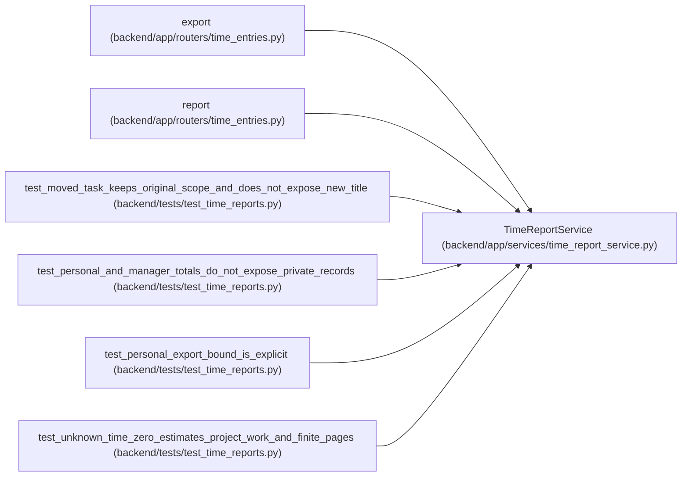

# TimeReportService

**Location:** `backend/app/services/time_report_service.py:16`
**Kind:** Class
**Bases:** —
**Module:** [time_report_service](../modules/time_report_service.md)

## Description

_Auto-generated from `TimeReportService` in `backend/app/services/time_report_service.py`._

## Attributes

*No annotated attributes found.*

## Methods

| Method | Signature | Decorators | Description |
|--------|-----------|------------|-------------|
| `__init__` | `(db)` | — | — |
| `statement` | *(async)* `(project_id, start, end, scope)` | — | — |
| `item` | `(row)` | `@staticmethod` | — |
| `page` | *(async)* `(project_id, start, end, *, scope = 'mine', after_id = 0, upper_id = None, limit = 50)` | — | — |
| `csv` | `(rows)` | `@staticmethod` | — |
| `export` | *(async)* `(project_id, start, end, *, scope = 'mine', kind = 'totals')` | — | — |

## Relationships

<!-- Auto-generated relationship summary. Do not edit by hand. -->

### Summary

| Module | Methods | Attributes |
|---|---:|---|
| [time_report_service](../modules/time_report_service.md) | 6 | — |

### References

| Reference | Kind | Source | Call sites |
|---|---|---|---:|
| `export` | call | [time_entries](../modules/time_entries.md) | 1 |
| `report` | call | [time_entries](../modules/time_entries.md) | 1 |
| `test_moved_task_keeps_original_scope_and_does_not_expose_new_title` | call | [test_time_reports](../modules/test_time_reports.md) | 1 |
| `test_personal_and_manager_totals_do_not_expose_private_records` | call | [test_time_reports](../modules/test_time_reports.md) | 7 |
| `test_personal_export_bound_is_explicit` | call | [test_time_reports](../modules/test_time_reports.md) | 1 |
| `test_unknown_time_zero_estimates_project_work_and_finite_pages` | call | [test_time_reports](../modules/test_time_reports.md) | 1 |
