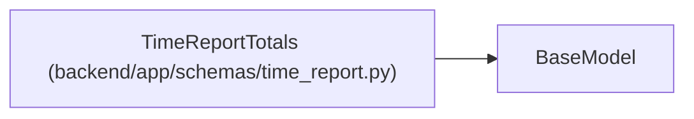

# TimeReportTotals

**Location:** `backend/app/schemas/time_report.py:17`
**Kind:** Pydantic model
**Bases:** `BaseModel`
**Module:** [time_report](../modules/time_report.md)

## Description

_Auto-generated from `TimeReportTotals` in `backend/app/schemas/time_report.py`._

## Attributes

| Name | Type | Wire name | Required | Nullable | Default | Constraints | Examples | Description |
|------|------|-----------|----------|----------|---------|-------------|-------------|----------|
| `task_count` | `int` | `task_count` | Yes | No | — | — | — | — |
| `tasks_with_records` | `int` | `tasks_with_records` | Yes | No | — | — | — | — |
| `recorded_minutes` | `int \| None` | `recorded_minutes` | Yes | Yes | — | — | — | — |
| `project_work_minutes` | `int \| None` | `project_work_minutes` | Yes | Yes | — | — | — | — |
| `known_estimate_hours` | `float \| None` | `known_estimate_hours` | Yes | Yes | — | — | — | — |
| `tasks_with_estimates` | `int` | `tasks_with_estimates` | Yes | No | — | — | — | — |

## Methods

*No public methods. Inherits from base classes.*

## Relationships

<!-- Auto-generated relationship summary. Do not edit by hand. -->

### Summary

| Module | Methods | Attributes |
|---|---:|---|
| [time_report](../modules/time_report.md) | 0 | `known_estimate_hours`, `project_work_minutes`, `recorded_minutes`, `task_count`, `tasks_with_estimates`, `tasks_with_records` |

### Structure

| Kind | Entity | Module |
|---|---|---|
| Base | `BaseModel` | — |
