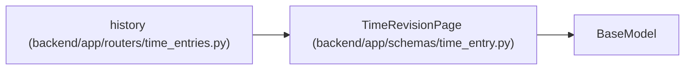

# TimeRevisionPage

**Location:** `backend/app/schemas/time_entry.py:92`
**Kind:** Pydantic model
**Bases:** `BaseModel`
**Module:** [schemas_time_entry](../modules/schemas_time_entry.md)

## Description

_Auto-generated from `TimeRevisionPage` in `backend/app/schemas/time_entry.py`._

## Attributes

| Name | Type | Wire name | Required | Nullable | Default | Constraints | Examples | Description |
|------|------|-----------|----------|----------|---------|-------------|-------------|----------|
| `items` | `list[TimeRevisionResponse]` | `items` | Yes | No | — | — | — | — |
| `has_more` | `bool` | `has_more` | Yes | No | — | — | — | — |
| `next_after_version` | `int \| None` | `next_after_version` | Yes | Yes | — | — | — | — |

## Methods

*No public methods. Inherits from base classes.*

## Relationships

<!-- Auto-generated relationship summary. Do not edit by hand. -->

### Summary

| Module | Methods | Attributes |
|---|---:|---|
| [schemas_time_entry](../modules/schemas_time_entry.md) | 0 | `has_more`, `items`, `next_after_version` |

### Structure

| Kind | Entity | Module |
|---|---|---|
| Base | `BaseModel` | — |

### References

| Reference | Kind | Source | Call sites |
|---|---|---|---:|
| `history` | type_reference | [time_entries](../modules/time_entries.md) | — |
