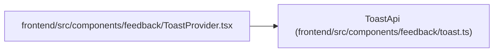

# ToastApi

**Location:** `frontend/src/components/feedback/toast.ts:17`
**Kind:** Class
**Bases:** —
**Module:** [toast](../modules/toast.md)

## Description

_Auto-generated from `ToastApi` in `frontend/src/components/feedback/toast.ts`._

## Attributes

| Name | Type | Default | Description |
|------|------|---------|-------------|
| `showToast` | `(input: ToastInput) => number` | *required* | — |
| `success` | `(message: string, options?: ToneToastOptions) => number` | *required* | — |
| `error` | `(message: string, options?: ToneToastOptions) => number` | *required* | — |
| `info` | `(message: string, options?: ToneToastOptions) => number` | *required* | — |
| `dismiss` | `(id: number) => void` | *required* | — |

## Methods

*No public methods. Inherits from base classes.*

## Relationships

<!-- Auto-generated relationship summary. Do not edit by hand. -->

### Summary

| Module | Methods | Attributes |
|---|---:|---|
| [toast](../modules/toast.md) | 0 | `dismiss`, `error`, `info`, `showToast`, `success` |

### References

| Reference | Kind | Source | Call sites |
|---|---|---|---:|
| `ToastProvider` | import | [ToastProvider](../modules/ToastProvider.md) | — |
