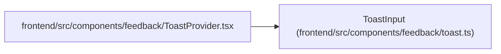

# ToastInput

**Location:** `frontend/src/components/feedback/toast.ts:5`
**Kind:** Class
**Bases:** —
**Module:** [toast](../modules/toast.md)

## Description

_Auto-generated from `ToastInput` in `frontend/src/components/feedback/toast.ts`._

## Attributes

| Name | Type | Default | Description |
|------|------|---------|-------------|
| `message` | `string` | *required* | — |
| `title` | `string` | *required* | — |
| `tone` | `ToastTone` | *required* | — |
| `dedupeKey` | `string` | *required* | — |
| `durationMs` | `number` | *required* | — |
| `actionLabel` | `string` | *required* | — |
| `onAction` | `() => void \| Promise<void>` | *required* | — |

## Methods

*No public methods. Inherits from base classes.*

## Relationships

<!-- Auto-generated relationship summary. Do not edit by hand. -->

### Summary

| Module | Methods | Attributes |
|---|---:|---|
| [toast](../modules/toast.md) | 0 | `actionLabel`, `dedupeKey`, `durationMs`, `message`, `onAction`, `title`, `tone` |

### References

| Reference | Kind | Source | Call sites |
|---|---|---|---:|
| `ToastProvider` | import | [ToastProvider](../modules/ToastProvider.md) | — |
