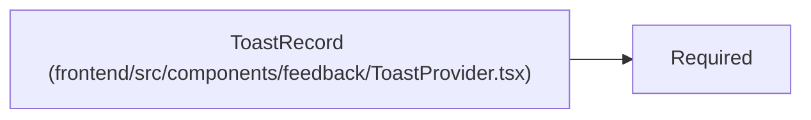

# ToastRecord

**Location:** `frontend/src/components/feedback/ToastProvider.tsx:13`
**Kind:** Class
**Bases:** `Required`
**Module:** [ToastProvider](../modules/ToastProvider.md)

## Description

_Auto-generated from `ToastRecord` in `frontend/src/components/feedback/ToastProvider.tsx`._

## Attributes

| Name | Type | Default | Description |
|------|------|---------|-------------|
| `id` | `number` | *required* | — |
| `key` | `string` | *required* | — |
| `title` | `string` | *required* | — |
| `actionLabel` | `string` | *required* | — |
| `onAction` | `() => void \| Promise<void>` | *required* | — |

## Methods

*No public methods. Inherits from base classes.*

## Relationships

<!-- Auto-generated relationship summary. Do not edit by hand. -->

### Summary

| Module | Methods | Attributes |
|---|---:|---|
| [ToastProvider](../modules/ToastProvider.md) | 0 | `actionLabel`, `id`, `key`, `onAction`, `title` |

### Structure

| Kind | Entity | Module |
|---|---|---|
| Base | `Required` | — |
