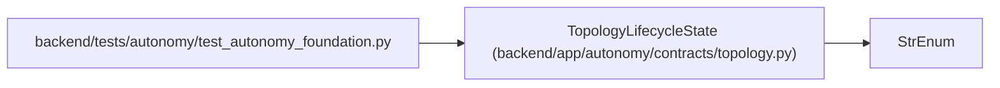

# TopologyLifecycleState

**Location:** `backend/app/autonomy/contracts/topology.py:78`
**Kind:** Enum
**Bases:** `StrEnum`
**Module:** [topology](../modules/topology.md)

## Description

_Auto-generated from `TopologyLifecycleState` in `backend/app/autonomy/contracts/topology.py`._

## Attributes

| Name | Declared value | Description |
|------|-------|-------------|
| `DESIRED` | `'desired'` | — |
| `CONFIGURED` | `'configured'` | — |
| `CREDENTIAL_DELIVERED` | `'credential_delivered'` | — |
| `ONBOARDING` | `'onboarding'` | — |
| `CONNECTED` | `'connected'` | — |
| `RUNTIME_READY` | `'runtime_ready'` | — |
| `DISABLED` | `'disabled'` | — |

## Methods

*No public methods. Inherits from base classes.*

## Relationships

<!-- Auto-generated relationship summary. Do not edit by hand. -->

### Summary

| Module | Methods | Attributes |
|---|---:|---|
| [topology](../modules/topology.md) | 0 | `CONFIGURED`, `CONNECTED`, `CREDENTIAL_DELIVERED`, `DESIRED`, `DISABLED`, `ONBOARDING`, `RUNTIME_READY` |

### Structure

| Kind | Entity | Module |
|---|---|---|
| Base | `StrEnum` | — |

### References

| Reference | Kind | Source | Call sites |
|---|---|---|---:|
| `test_autonomy_foundation` | import | [test_autonomy_foundation](../modules/test_autonomy_foundation.md) | — |
