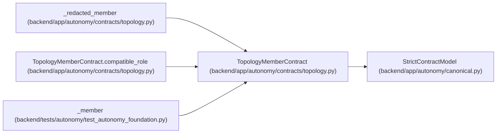

# TopologyMemberContract

**Location:** `backend/app/autonomy/contracts/topology.py:131`
**Kind:** Pydantic model
**Bases:** `StrictContractModel`
**Module:** [topology](../modules/topology.md)

## Description

_Auto-generated from `TopologyMemberContract` in `backend/app/autonomy/contracts/topology.py`._

## Validators

| Method | Scope | Fields | Mode | Options |
|--------|-------|--------|------|---------|
| `unique_sequence` | field | scopes, external_lease_classes | after | — |
| `valid_skills` | field | skill_requirements | after | — |
| `compatible_role` | model | — | after | — |

## Attributes

| Name | Type | Wire name | Required | Nullable | Default | Constraints | Examples | Description |
|------|------|-----------|----------|----------|---------|-------------|-------------|----------|
| `logical_key` | `str` | `logical_key` | Yes | No | — | pattern=unknown (LOGICAL_KEY_PATTERN) | — | — |
| `actor_name` | `str` | `actor_name` | Yes | No | — | pattern=unknown (LOGICAL_KEY_PATTERN) | — | — |
| `role` | `Literal['pm', 'worker', 'verifier']` | `role` | Yes | No | — | — | — | — |
| `primary_controller` | `bool` | `primary_controller` | No | No | `False` | — | — | — |
| `scope_preset` | `Literal['postgresql-pm-v1', 'postgresql-worker-v1', 'postgresql-verifier-v1']` | `scope_preset` | Yes | No | — | — | — | — |
| `scopes` | `tuple[str, ...]` | `scopes` | Yes | No | — | min_length=1; max_length=64 | — | — |
| `profile_key` | `str` | `profile_key` | Yes | No | — | pattern=unknown (LOGICAL_KEY_PATTERN) | — | — |
| `profile_revision` | `int` | `profile_revision` | Yes | No | — | ge=1 | — | — |
| `skill_requirements` | `dict[str, int]` | `skill_requirements` | No | No | factory: `dict` | max_length=128 | — | — |
| `model_bindings` | `tuple[ModelBindingContract, ...]` | `model_bindings` | Yes | No | — | min_length=1; max_length=32 | — | — |
| `role_package` | `RolePackageContract` | `role_package` | Yes | No | — | — | — | — |
| `runtime` | `RuntimeContract` | `runtime` | Yes | No | — | — | — | — |
| `independence_group` | `str` | `independence_group` | Yes | No | — | pattern=unknown (LOGICAL_KEY_PATTERN) | — | — |
| `workload_identity_subject` | `str` | `workload_identity_subject` | Yes | No | — | min_length=1; max_length=512 | — | — |
| `kms_key_ref` | `str` | `kms_key_ref` | Yes | No | — | max_length=1024; pattern=unknown (OPAQUE_REF_PATTERN) | — | — |
| `external_lease_classes` | `tuple[str, ...]` | `external_lease_classes` | No | No | `()` | max_length=128 | — | — |
| `work_policy` | `Literal['assigned_only']` | `work_policy` | No | No | `'assigned_only'` | — | — | — |
| `max_parallel_work` | `Literal[1]` | `max_parallel_work` | No | No | `1` | — | — | — |

## Methods

| Method | Signature | Decorators | Description |
|--------|-----------|------------|-------------|
| `unique_sequence` | `(value: tuple[str, ...]) -> tuple[str, ...]` | `@field_validator('scopes', 'external_lease_classes')`, `@classmethod` | — |
| `valid_skills` | `(value: dict[str, int]) -> dict[str, int]` | `@field_validator('skill_requirements')`, `@classmethod` | — |
| `compatible_role` | `() -> 'TopologyMemberContract'` | `@model_validator(mode='after')` | — |

## Relationships

<!-- Auto-generated relationship summary. Do not edit by hand. -->

### Summary

| Module | Methods | Attributes |
|---|---:|---|
| [topology](../modules/topology.md) | 3 | `actor_name`, `external_lease_classes`, `independence_group`, `kms_key_ref`, `logical_key`, `max_parallel_work`, `model_bindings`, `primary_controller`, `profile_key`, `profile_revision`, `role`, `role_package` |

### Structure

| Kind | Entity | Module |
|---|---|---|
| Base | `StrictContractModel` | [autonomy_canonical](../modules/autonomy_canonical.md) |

### References

| Reference | Kind | Source | Call sites |
|---|---|---|---:|
| `_redacted_member` | type_reference | [topology](../modules/topology.md) | — |
| `TopologyMemberContract.compatible_role` | type_reference | [topology](../modules/topology.md) | — |
| `_member` | call | [test_autonomy_foundation](../modules/test_autonomy_foundation.md) | 1 |
| `_member` | type_reference | [test_autonomy_foundation](../modules/test_autonomy_foundation.md) | — |
