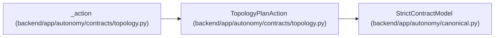

# TopologyPlanAction

**Location:** `backend/app/autonomy/contracts/topology.py:256`
**Kind:** Pydantic model
**Bases:** `StrictContractModel`
**Module:** [topology](../modules/topology.md)

## Description

_Auto-generated from `TopologyPlanAction` in `backend/app/autonomy/contracts/topology.py`._

## Attributes

| Name | Type | Wire name | Required | Nullable | Default | Constraints | Examples | Description |
|------|------|-----------|----------|----------|---------|-------------|-------------|----------|
| `action_id` | `str` | `action_id` | Yes | No | — | pattern=unknown (LOGICAL_KEY_PATTERN) | — | — |
| `action_digest` | `str` | `action_digest` | Yes | No | — | pattern=unknown (SHA256_PATTERN) | — | — |
| `reconciliation_class` | `ReconciliationClass` | `reconciliation_class` | Yes | No | — | — | — | — |
| `logical_key` | `str` | `logical_key` | Yes | No | — | pattern=unknown (LOGICAL_KEY_PATTERN) | — | — |
| `target_revision` | `int \| None` | `target_revision` | No | Yes | `None` | ge=1 | — | — |
| `before` | `dict[str, Any] \| None` | `before` | No | Yes | `None` | — | — | — |
| `after` | `dict[str, Any] \| None` | `after` | No | Yes | `None` | — | — | — |
| `blocker_code` | `str \| None` | `blocker_code` | No | Yes | `None` | pattern=unknown (LOGICAL_KEY_PATTERN) | — | — |
| `requires_explicit_confirmation` | `bool` | `requires_explicit_confirmation` | No | No | `False` | — | — | — |

## Methods

*No public methods. Inherits from base classes.*

## Relationships

<!-- Auto-generated relationship summary. Do not edit by hand. -->

### Summary

| Module | Methods | Attributes |
|---|---:|---|
| [topology](../modules/topology.md) | 0 | `action_digest`, `action_id`, `after`, `before`, `blocker_code`, `logical_key`, `reconciliation_class`, `requires_explicit_confirmation`, `target_revision` |

### Structure

| Kind | Entity | Module |
|---|---|---|
| Base | `StrictContractModel` | [autonomy_canonical](../modules/autonomy_canonical.md) |

### References

| Reference | Kind | Source | Call sites |
|---|---|---|---:|
| `_action` | call | [topology](../modules/topology.md) | 1 |
| `_action` | type_reference | [topology](../modules/topology.md) | — |
