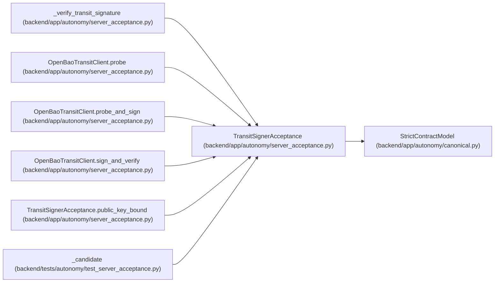

# TransitSignerAcceptance

**Location:** `backend/app/autonomy/server_acceptance.py:81`
**Kind:** Pydantic model
**Bases:** `StrictContractModel`
**Module:** [autonomy_server_acceptance](../modules/autonomy_server_acceptance.md)

## Description

_Auto-generated from `TransitSignerAcceptance` in `backend/app/autonomy/server_acceptance.py`._

## Validators

| Method | Scope | Fields | Mode | Options |
|--------|-------|--------|------|---------|
| `public_key_bound` | model | — | after | — |

## Attributes

| Name | Type | Wire name | Required | Nullable | Default | Constraints | Examples | Description |
|------|------|-----------|----------|----------|---------|-------------|-------------|----------|
| `implementation` | `Literal['openbao-transit']` | `implementation` | No | No | `'openbao-transit'` | — | — | — |
| `key_ref` | `str` | `key_ref` | Yes | No | — | pattern=unknown (IDENTIFIER_PATTERN) | — | — |
| `key_type` | `Literal['ed25519']` | `key_type` | Yes | No | — | — | — | — |
| `key_version` | `int` | `key_version` | Yes | No | — | ge=1 | — | — |
| `public_key_base64` | `str` | `public_key_base64` | Yes | No | — | pattern='^[A-Za-z0-9+/]+={0,2}$' | — | — |
| `public_key_sha256` | `str` | `public_key_sha256` | Yes | No | — | pattern=unknown (SHA256_PATTERN) | — | — |
| `exportable` | `Literal[False]` | `exportable` | No | No | `False` | — | — | — |
| `plaintext_backup_allowed` | `Literal[False]` | `plaintext_backup_allowed` | No | No | `False` | — | — | — |
| `round_trip_verified` | `Literal[True]` | `round_trip_verified` | No | No | `True` | — | — | — |

## Methods

| Method | Signature | Decorators | Description |
|--------|-----------|------------|-------------|
| `public_key_bound` | `() -> 'TransitSignerAcceptance'` | `@model_validator(mode='after')` | — |

## Relationships

<!-- Auto-generated relationship summary. Do not edit by hand. -->

### Summary

| Module | Methods | Attributes |
|---|---:|---|
| [autonomy_server_acceptance](../modules/autonomy_server_acceptance.md) | 1 | `exportable`, `implementation`, `key_ref`, `key_type`, `key_version`, `plaintext_backup_allowed`, `public_key_base64`, `public_key_sha256`, `round_trip_verified` |

### Structure

| Kind | Entity | Module |
|---|---|---|
| Base | `StrictContractModel` | [autonomy_canonical](../modules/autonomy_canonical.md) |

### References

| Reference | Kind | Source | Call sites |
|---|---|---|---:|
| `_verify_transit_signature` | type_reference | [autonomy_server_acceptance](../modules/autonomy_server_acceptance.md) | — |
| `OpenBaoTransitClient.probe` | call | [autonomy_server_acceptance](../modules/autonomy_server_acceptance.md) | 1 |
| `OpenBaoTransitClient.probe` | type_reference | [autonomy_server_acceptance](../modules/autonomy_server_acceptance.md) | — |
| `OpenBaoTransitClient.probe_and_sign` | type_reference | [autonomy_server_acceptance](../modules/autonomy_server_acceptance.md) | — |
| `OpenBaoTransitClient.sign_and_verify` | type_reference | [autonomy_server_acceptance](../modules/autonomy_server_acceptance.md) | — |
| `TransitSignerAcceptance.public_key_bound` | type_reference | [autonomy_server_acceptance](../modules/autonomy_server_acceptance.md) | — |
| `_candidate` | call | [test_server_acceptance](../modules/test_server_acceptance.md) | 1 |
