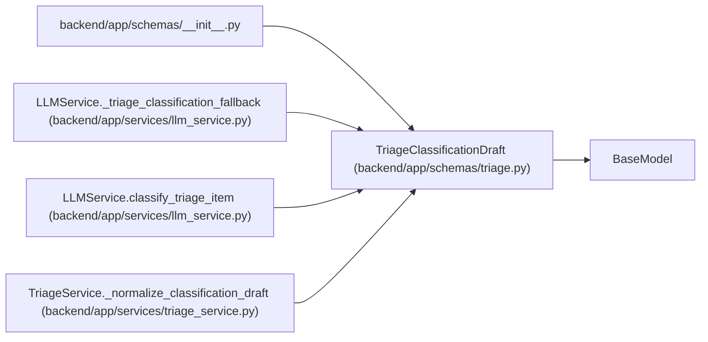

# TriageClassificationDraft

**Location:** `backend/app/schemas/triage.py:189`
**Kind:** Pydantic model
**Bases:** `BaseModel`
**Module:** [schemas_triage](../modules/schemas_triage.md)

## Description

Internal normalized triage classification draft before persistence.

## Model Configuration

| Setting | Value | Source |
|---------|-------|--------|
| `extra` | `'ignore'` | model_config |

## Attributes

| Name | Type | Wire name | Required | Nullable | Default | Constraints | Examples | Description |
|------|------|-----------|----------|----------|---------|-------------|-------------|----------|
| `suggested_type_label_slug` | `Optional[str]` | `suggested_type_label_slug` | No | Yes | `None` | max_length=100 | — | — |
| `suggested_area_label_slug` | `Optional[str]` | `suggested_area_label_slug` | No | Yes | `None` | max_length=100 | — | — |
| `suggested_priority` | `Optional[int]` | `suggested_priority` | No | Yes | `None` | ge=1; le=10 | — | — |
| `suggested_label_slugs` | `list[str]` | `suggested_label_slugs` | No | No | factory: `list` | — | — | — |
| `unmatched_label_text` | `list[str]` | `unmatched_label_text` | No | No | factory: `list` | — | — | — |
| `suggested_assignee_id` | `Optional[int]` | `suggested_assignee_id` | No | Yes | `None` | — | — | — |
| `suggested_assignee_hint` | `Optional[str]` | `suggested_assignee_hint` | No | Yes | `None` | max_length=255 | — | — |
| `suggested_project_id` | `Optional[int]` | `suggested_project_id` | No | Yes | `None` | — | — | — |
| `duplicate_candidates` | `list[dict[str, Any]]` | `duplicate_candidates` | No | No | factory: `list` | — | — | — |
| `confidence` | `float` | `confidence` | No | No | `0.0` | ge=0; le=1 | — | — |
| `rationale` | `Optional[str]` | `rationale` | No | Yes | `None` | — | — | — |
| `language` | `str` | `language` | No | No | `'en'` | — | — | — |
| `is_fallback` | `bool` | `is_fallback` | No | No | `False` | — | — | — |
| `raw_response_json` | `dict[str, Any]` | `raw_response_json` | No | No | factory: `dict` | — | — | — |

## Methods

*No public methods. Inherits from base classes.*

## Relationships

<!-- Auto-generated relationship summary. Do not edit by hand. -->

### Summary

| Module | Methods | Attributes |
|---|---:|---|
| [schemas_triage](../modules/schemas_triage.md) | 0 | `confidence`, `duplicate_candidates`, `is_fallback`, `language`, `rationale`, `raw_response_json`, `suggested_area_label_slug`, `suggested_assignee_hint`, `suggested_assignee_id`, `suggested_label_slugs`, `suggested_priority`, `suggested_project_id` |

### Structure

| Kind | Entity | Module |
|---|---|---|
| Base | `BaseModel` | — |

### References

| Reference | Kind | Source | Call sites |
|---|---|---|---:|
| `__init__` | import | [schemas___init__](../modules/schemas___init__.md) | — |
| `LLMService._triage_classification_fallback` | call | [llm_service](../modules/llm_service.md) | 1 |
| `LLMService._triage_classification_fallback` | type_reference | [llm_service](../modules/llm_service.md) | — |
| `LLMService.classify_triage_item` | call | [llm_service](../modules/llm_service.md) | 1 |
| `LLMService.classify_triage_item` | type_reference | [llm_service](../modules/llm_service.md) | — |
| `TriageService._normalize_classification_draft` | call | [triage_service](../modules/triage_service.md) | 1 |
| `TriageService._normalize_classification_draft` | type_reference | [triage_service](../modules/triage_service.md) | — |
