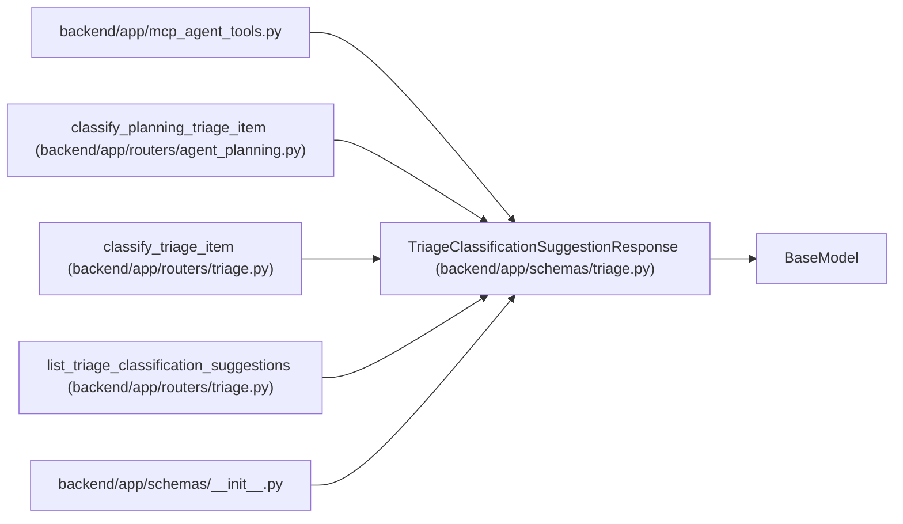

# TriageClassificationSuggestionResponse

**Location:** `backend/app/schemas/triage.py:178`
**Kind:** Pydantic model
**Bases:** `BaseModel`
**Module:** [schemas_triage](../modules/schemas_triage.md)

## Description

Stored advisory classification suggestion for a triage item.

## Model Configuration

| Setting | Value | Source |
|---------|-------|--------|
| `from_attributes` | `True` | model_config |

## Attributes

| Name | Type | Wire name | Required | Nullable | Default | Constraints | Examples | Description |
|------|------|-----------|----------|----------|---------|-------------|-------------|----------|
| `id` | `int` | `id` | Yes | No | — | — | — | — |
| `triage_item_id` | `int` | `triage_item_id` | Yes | No | — | — | — | — |
| `suggested_type_label_slug` | `Optional[str]` | `suggested_type_label_slug` | No | Yes | `None` | — | — | — |
| `suggested_area_label_slug` | `Optional[str]` | `suggested_area_label_slug` | No | Yes | `None` | — | — | — |
| `suggested_priority` | `Optional[int]` | `suggested_priority` | No | Yes | `None` | — | — | — |
| `suggested_label_slugs` | `list[str]` | `suggested_label_slugs` | No | No | factory: `list` | — | — | — |
| `unmatched_label_text` | `list[str]` | `unmatched_label_text` | No | No | factory: `list` | — | — | — |
| `suggested_assignee_id` | `Optional[int]` | `suggested_assignee_id` | No | Yes | `None` | — | — | — |
| `suggested_assignee_hint` | `Optional[str]` | `suggested_assignee_hint` | No | Yes | `None` | — | — | — |
| `suggested_project_id` | `Optional[int]` | `suggested_project_id` | No | Yes | `None` | — | — | — |
| `duplicate_candidates` | `list[dict[str, Any]]` | `duplicate_candidates` | No | No | factory: `list` | — | — | — |
| `confidence` | `float` | `confidence` | No | No | `0.0` | — | — | — |
| `rationale` | `Optional[str]` | `rationale` | No | Yes | `None` | — | — | — |
| `language` | `Optional[str]` | `language` | No | Yes | `None` | — | — | — |
| `provider` | `Optional[str]` | `provider` | No | Yes | `None` | — | — | — |
| `model` | `Optional[str]` | `model` | No | Yes | `None` | — | — | — |
| `is_fallback` | `bool` | `is_fallback` | No | No | `False` | — | — | — |
| `raw_response_json` | `dict[str, Any]` | `raw_response_json` | No | No | factory: `dict` | — | — | — |
| `created_at` | `datetime` | `created_at` | Yes | No | — | — | — | — |

## Methods

*No public methods. Inherits from base classes.*

## Relationships

<!-- Auto-generated relationship summary. Do not edit by hand. -->

### Summary

| Module | Methods | Attributes |
|---|---:|---|
| [schemas_triage](../modules/schemas_triage.md) | 0 | `confidence`, `created_at`, `duplicate_candidates`, `id`, `is_fallback`, `language`, `model`, `provider`, `rationale`, `raw_response_json`, `suggested_area_label_slug`, `suggested_assignee_hint` |

### Structure

| Kind | Entity | Module |
|---|---|---|
| Base | `BaseModel` | — |

### References

| Reference | Kind | Source | Call sites |
|---|---|---|---:|
| `mcp_agent_tools` | import | [mcp_agent_tools](../modules/mcp_agent_tools.md) | — |
| `classify_planning_triage_item` | type_reference | [routers_agent_planning](../modules/routers_agent_planning.md) | — |
| `classify_triage_item` | type_reference | [routers_triage](../modules/routers_triage.md) | — |
| `list_triage_classification_suggestions` | type_reference | [routers_triage](../modules/routers_triage.md) | — |
| `__init__` | import | [schemas___init__](../modules/schemas___init__.md) | — |
