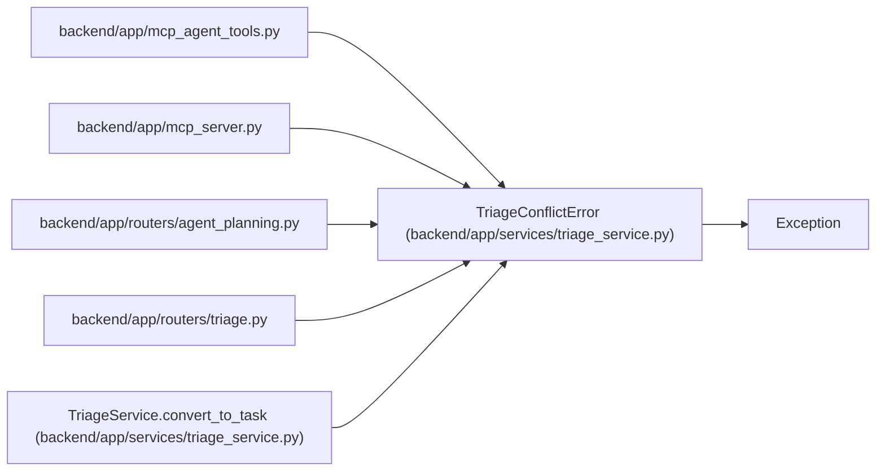

# TriageConflictError

**Location:** `backend/app/services/triage_service.py:44`
**Kind:** Class
**Bases:** `Exception`
**Module:** [triage_service](../modules/triage_service.md)

## Description

Raised when a triage action conflicts with current item state.

## Attributes

*No annotated attributes found.*

## Methods

*No public methods. Inherits from base classes.*

## Relationships

<!-- Auto-generated relationship summary. Do not edit by hand. -->

### Summary

| Module | Methods | Attributes |
|---|---:|---|
| [triage_service](../modules/triage_service.md) | 0 | — |

### Structure

| Kind | Entity | Module |
|---|---|---|
| Base | `Exception` | — |

### References

| Reference | Kind | Source | Call sites |
|---|---|---|---:|
| `mcp_agent_tools` | import | [mcp_agent_tools](../modules/mcp_agent_tools.md) | — |
| `mcp_server` | import | [mcp_server](../modules/mcp_server.md) | — |
| `agent_planning` | import | [routers_agent_planning](../modules/routers_agent_planning.md) | — |
| `triage` | import | [routers_triage](../modules/routers_triage.md) | — |
| `TriageService.convert_to_task` | call | [triage_service](../modules/triage_service.md) | 2 |
