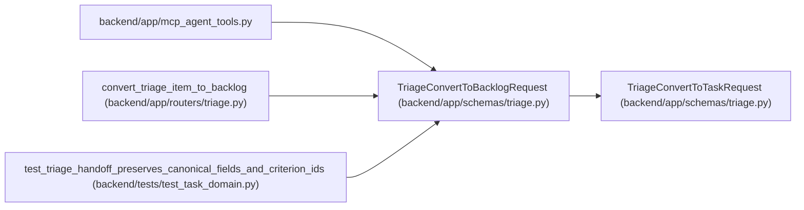

# TriageConvertToBacklogRequest

**Location:** `backend/app/schemas/triage.py:294`
**Kind:** Pydantic model
**Bases:** `TriageConvertToTaskRequest`
**Module:** [schemas_triage](../modules/schemas_triage.md)

## Description

Explicit project backlog destination; the legacy iteration contract stays required.

## Attributes

| Name | Type | Wire name | Required | Nullable | Default | Constraints | Examples | Description |
|------|------|-----------|----------|----------|---------|-------------|-------------|----------|
| `project_id` | `int` | `project_id` | Yes | No | — | ge=1 | — | — |
| `iteration_id` | `None` | `iteration_id` | No | Yes | `None` | — | — | — |
| `destination` | `Literal['project_backlog']` | `destination` | No | No | `'project_backlog'` | — | — | — |

## Methods

*No public methods. Inherits from base classes.*

## Relationships

<!-- Auto-generated relationship summary. Do not edit by hand. -->

### Summary

| Module | Methods | Attributes |
|---|---:|---|
| [schemas_triage](../modules/schemas_triage.md) | 0 | `destination`, `iteration_id`, `project_id` |

### Structure

| Kind | Entity | Module |
|---|---|---|
| Base | `TriageConvertToTaskRequest` | [schemas_triage](../modules/schemas_triage.md) |

### References

| Reference | Kind | Source | Call sites |
|---|---|---|---:|
| `mcp_agent_tools` | import | [mcp_agent_tools](../modules/mcp_agent_tools.md) | — |
| `convert_triage_item_to_backlog` | type_reference | [routers_triage](../modules/routers_triage.md) | — |
| `test_triage_handoff_preserves_canonical_fields_and_criterion_ids` | call | [test_task_domain](../modules/test_task_domain.md) | 1 |
