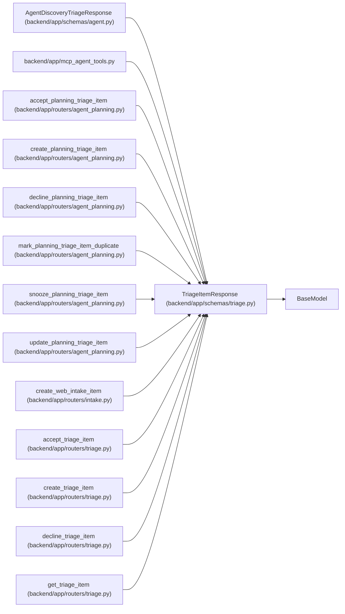

# TriageItemResponse

**Location:** `backend/app/schemas/triage.py:79`
**Kind:** Pydantic model
**Bases:** `BaseModel`
**Module:** [schemas_triage](../modules/schemas_triage.md)

## Description

Schema for triage item response.

## Model Configuration

| Setting | Value | Source |
|---------|-------|--------|
| `from_attributes` | `True` | config_class |

## Attributes

| Name | Type | Wire name | Required | Nullable | Default | Constraints | Examples | Description |
|------|------|-----------|----------|----------|---------|-------------|-------------|----------|
| `id` | `int` | `id` | Yes | No | — | — | — | — |
| `title` | `str` | `title` | Yes | No | — | — | — | — |
| `description` | `Optional[str]` | `description` | No | Yes | `None` | — | — | — |
| `source` | `Optional[str]` | `source` | No | Yes | `None` | — | — | — |
| `source_url` | `Optional[str]` | `source_url` | No | Yes | `None` | — | — | — |
| `external_key` | `Optional[str]` | `external_key` | No | Yes | `None` | — | — | — |
| `status` | `str` | `status` | Yes | No | — | — | — | — |
| `priority_hint` | `Optional[int]` | `priority_hint` | No | Yes | `None` | — | — | — |
| `assignee_hint` | `Optional[str]` | `assignee_hint` | No | Yes | `None` | — | — | — |
| `project_hint_id` | `Optional[int]` | `project_hint_id` | No | Yes | `None` | — | — | — |
| `iteration_hint_id` | `Optional[int]` | `iteration_hint_id` | No | Yes | `None` | — | — | — |
| `labels` | `list[str]` | `labels` | No | No | factory: `list` | — | — | — |
| `metadata_json` | `dict[str, Any]` | `metadata_json` | No | No | factory: `dict` | — | — | — |
| `snoozed_until` | `Optional[datetime]` | `snoozed_until` | No | Yes | `None` | — | — | — |
| `duplicate_of_id` | `Optional[int]` | `duplicate_of_id` | No | Yes | `None` | — | — | — |
| `duplicate_task_id` | `Optional[int]` | `duplicate_task_id` | No | Yes | `None` | — | — | — |
| `converted_task_id` | `Optional[int]` | `converted_task_id` | No | Yes | `None` | — | — | — |
| `request_count` | `int` | `request_count` | No | No | `0` | — | — | — |
| `created_at` | `datetime` | `created_at` | Yes | No | — | — | — | — |
| `updated_at` | `datetime` | `updated_at` | Yes | No | — | — | — | — |

## Methods

*No public methods. Inherits from base classes.*

## Relationships

<!-- Auto-generated relationship summary. Do not edit by hand. -->

### Summary

| Module | Methods | Attributes |
|---|---:|---|
| [schemas_triage](../modules/schemas_triage.md) | 0 | `assignee_hint`, `converted_task_id`, `created_at`, `description`, `duplicate_of_id`, `duplicate_task_id`, `external_key`, `id`, `iteration_hint_id`, `labels`, `metadata_json`, `priority_hint` |

### Structure

| Kind | Entity | Module |
|---|---|---|
| Base | `BaseModel` | — |
| Subclass | `AgentDiscoveryTriageResponse` | [schemas_agent](../modules/schemas_agent.md) |

### References

| Reference | Kind | Source | Call sites |
|---|---|---|---:|
| `mcp_agent_tools` | import | [mcp_agent_tools](../modules/mcp_agent_tools.md) | — |
| `accept_planning_triage_item` | type_reference | [routers_agent_planning](../modules/routers_agent_planning.md) | — |
| `create_planning_triage_item` | type_reference | [routers_agent_planning](../modules/routers_agent_planning.md) | — |
| `decline_planning_triage_item` | type_reference | [routers_agent_planning](../modules/routers_agent_planning.md) | — |
| `mark_planning_triage_item_duplicate` | type_reference | [routers_agent_planning](../modules/routers_agent_planning.md) | — |
| `snooze_planning_triage_item` | type_reference | [routers_agent_planning](../modules/routers_agent_planning.md) | — |
| `update_planning_triage_item` | type_reference | [routers_agent_planning](../modules/routers_agent_planning.md) | — |
| `create_web_intake_item` | type_reference | [routers_intake](../modules/routers_intake.md) | — |
| `accept_triage_item` | type_reference | [routers_triage](../modules/routers_triage.md) | — |
| `create_triage_item` | type_reference | [routers_triage](../modules/routers_triage.md) | — |
| `decline_triage_item` | type_reference | [routers_triage](../modules/routers_triage.md) | — |
| `get_triage_item` | type_reference | [routers_triage](../modules/routers_triage.md) | — |

> References: showing 12 of 18 logical references; 6 omitted by the 12-row generated summary limit.
