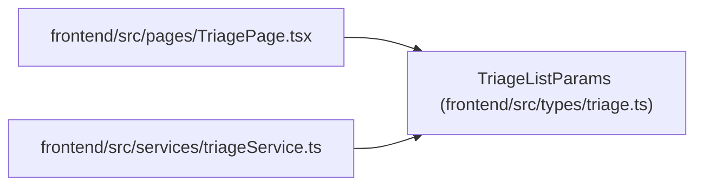

# TriageListParams

**Location:** `frontend/src/types/triage.ts:46`
**Kind:** Class
**Bases:** —
**Module:** [types_triage](../modules/types_triage.md)

## Description

_Auto-generated from `TriageListParams` in `frontend/src/types/triage.ts`._

## Attributes

| Name | Type | Required | Default | Description |
|------|------|----------|---------|-------------|
| `active` | `boolean` | No | — | — |
| `statuses` | `TriageItemStatus[]` | No | — | — |
| `q` | `string` | No | — | — |
| `source` | `string` | No | — | — |
| `limit` | `number` | No | — | — |
| `offset` | `number` | No | — | — |

## Methods

*No public methods. Inherits from base classes.*

## Relationships

<!-- Auto-generated relationship summary. Do not edit by hand. -->

### Summary

| Module | Methods | Attributes |
|---|---:|---|
| [types_triage](../modules/types_triage.md) | 0 | `active`, `limit`, `offset`, `q`, `source`, `statuses` |

### References

| Reference | Kind | Source | Call sites |
|---|---|---|---:|
| `TriagePage` | import | [TriagePage](../modules/TriagePage.md) | — |
| `triageService` | import | [triageService](../modules/triageService.md) | — |
