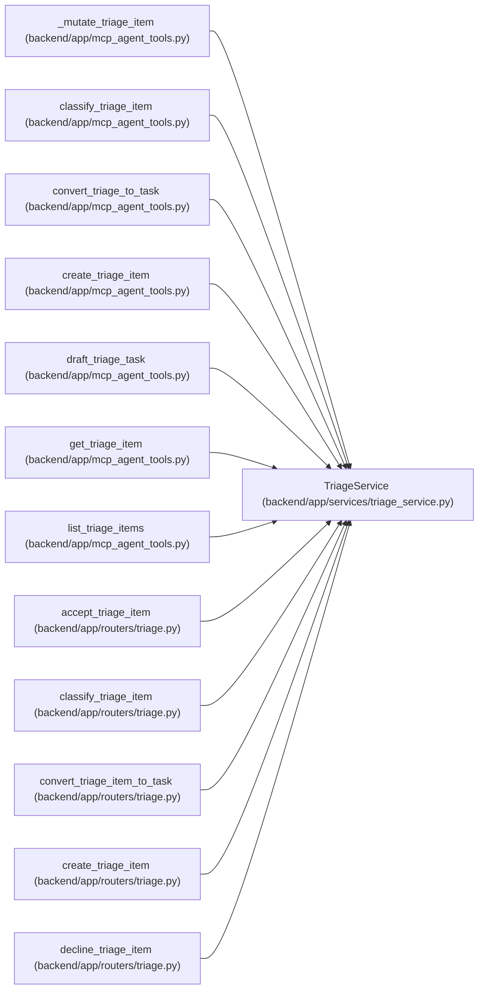

# TriageService

**Location:** `backend/app/services/triage_service.py:54`
**Kind:** Class
**Bases:** —
**Module:** [triage_service](../modules/triage_service.md)

## Description

Service for triage CRUD, inbox filtering, lifecycle actions, and conversion.

## Attributes

*No annotated attributes found.*

## Methods

| Method | Signature | Decorators | Description |
|--------|-----------|------------|-------------|
| `__init__` | `(db: AsyncSession)` | — | — |
| `_enum_value` | `(value)` | — | Normalize Pydantic enum values before assigning to string columns. |
| `_query` | `() -> Select` | — | Build the base triage query. |
| `_response_options` | `() -> tuple` | — | Return relationship loading options needed for API responses. |
| `_exists` | *(async)* `(model, entity_id: int) -> bool` | — | — |
| `_require_project_exists` | *(async)* `(project_id: Optional[int]) -> None` | — | — |
| `_require_iteration_exists` | *(async)* `(iteration_id: Optional[int]) -> None` | — | — |
| `_require_plannable_iteration` | *(async)* `(iteration_id: int) -> Iteration` | — | Load the target iteration for conversion, reserving lifecycle checks here. |
| `_require_assignee_exists` | *(async)* `(assignee_id: Optional[int]) -> None` | — | — |
| `_require_task_exists` | *(async)* `(task_id: Optional[int]) -> None` | — | — |
| `_require_duplicate_item_exists` | *(async)* `(triage_item_id: int, duplicate_of_id: Optional[int]) -> None` | — | — |
| `_validate_common_references` | *(async)* `(project_hint_id: Optional[int] = None, iteration_hint_id: Optional[int] = None, duplicate_of_id: Optional[int] = None, duplicate_task_id: Optional[int] = None, converted_task_id: Optional[int] = None, triage_item_id: Optional[int] = None) -> None` | — | — |
| `_record_triage_event` | *(async)* `(event_type: str, triage_item_id: int, payload: Optional[dict[str, Any]] = None) -> None` | — | — |
| `_filtered_list_query` | `(active: Optional[bool] = True, statuses: Optional[Sequence[TriageItemStatus \| str]] = None, q: Optional[str] = None, source: Optional[str] = None) -> Select` | — | Build a triage list query without ordering or pagination. |
| `count_items` | *(async)* `(active: Optional[bool] = True, statuses: Optional[Sequence[TriageItemStatus \| str]] = None, q: Optional[str] = None, source: Optional[str] = None) -> int` | — | Count triage items using the same filters as the list endpoint. |
| `list_items` | *(async)* `(active: Optional[bool] = True, statuses: Optional[Sequence[TriageItemStatus \| str]] = None, q: Optional[str] = None, source: Optional[str] = None, limit: int = 100, offset: int = 0) -> Sequence[TriageItem]` | — | List triage items with default active inbox filtering. |
| `get_by_id` | *(async)* `(triage_item_id: int, *, for_update: bool = False) -> Optional[TriageItem]` | — | Get a triage item by ID, optionally locking it for a mutation. |
| `list_classification_suggestions` | *(async)* `(triage_item_id: int, limit: int = 20) -> Optional[Sequence[TriageClassificationSuggestion]]` | — | List stored classification suggestions for a triage item. |
| `classify_item` | *(async)* `(triage_item_id: int, llm_service: Optional[LLMService] = None, *, commit: bool = True) -> Optional[TriageClassificationSuggestion]` | — | Create an advisory classification suggestion for a triage item. |
| `draft_task` | *(async)* `(triage_item_id: int, data: TriageTaskDraftRequest, llm_service: Optional[LLMService] = None) -> Optional[TriageTaskDraftResponse]` | — | Generate transient task details for triage conversion. |
| `_get_task_draft_template` | *(async)* `(template_id: Optional[int]) -> Optional[WorkTemplate]` | — | Load and validate an optional active task template for drafting. |
| `_get_task_draft_classification` | *(async)* `(triage_item_id: int, classification_suggestion_id: Optional[int]) -> Optional[TriageClassificationSuggestion]` | — | Load an explicit or latest classification suggestion for drafting. |
| `_task_template_context` | `(template: WorkTemplate) -> dict[str, Any]` | — | Return compact template context for task drafting. |
| `_classification_suggestion_context` | `(suggestion: TriageClassificationSuggestion) -> dict[str, Any]` | — | Return compact classification context for task drafting. |
| `_get_classification_item` | *(async)* `(triage_item_id: int) -> Optional[TriageItem]` | — | Load a triage item with context used by classification. |
| `_classification_label_context` | *(async)* `() -> tuple[list[dict[str, Any]], dict[str, Any]]` | — | Return active label context and normalization metadata. |
| `_classification_project_context` | *(async)* `() -> list[dict[str, Any]]` | — | Return compact project candidates for classification. |
| `_classification_assignee_context` | *(async)* `(iteration_id: Optional[int]) -> list[dict[str, Any]]` | — | Return iteration team member candidates for classification. |
| `_classification_duplicate_candidates` | *(async)* `(triage_item_id: int) -> list[dict[str, Any]]` | — | Return flattened duplicate candidates from the existing advisory search. |
| `_triage_item_context` | `(item: TriageItem) -> dict[str, Any]` | — | Return compact triage item context for classification. |
| `_normalize_classification_draft` | `(draft: TriageClassificationDraft, label_meta: dict[str, Any], projects: list[dict[str, Any]], assignees: list[dict[str, Any]], duplicate_candidates: list[dict[str, Any]]) -> TriageClassificationDraft` | — | Normalize provider/fallback suggestions against current system state. |
| `_slug_text` | `(value: Any) -> Optional[str]` | — | Normalize a label slug candidate. |
| `_valid_slug` | `(value: Any, valid_slugs: set[str]) -> Optional[str]` | — | Return a slug only when it belongs to the expected label group. |
| `_clean_optional_text` | `(value: Optional[str]) -> Optional[str]` | — | Trim optional text fields. |
| `_dedupe_strings` | `(values: list[str]) -> list[str]` | — | Return non-empty strings without duplicates. |
| `create` | *(async)* `(data: TriageItemCreate, *, commit: bool = True) -> TriageItem` | — | Create a triage item. |
| `update` | *(async)* `(triage_item_id: int, data: TriageItemUpdate, *, commit: bool = True) -> Optional[TriageItem]` | — | Apply editable triage metadata updates. |
| `accept` | *(async)* `(triage_item_id: int, data: Optional[TriageActionRequest] = None, *, commit: bool = True) -> Optional[TriageItem]` | — | Accept a triage item into the intake inbox. |
| `decline` | *(async)* `(triage_item_id: int, data: Optional[TriageActionRequest] = None, *, commit: bool = True) -> Optional[TriageItem]` | — | Decline a triage item while keeping it searchable. |
| `snooze` | *(async)* `(triage_item_id: int, data: TriageSnoozeRequest, *, commit: bool = True) -> Optional[TriageItem]` | — | Snooze a triage item until a future time. |
| `mark_duplicate` | *(async)* `(triage_item_id: int, data: TriageDuplicateRequest, *, commit: bool = True) -> Optional[TriageItem]` | — | Mark a triage item as duplicate of another item or task. |
| `_json_list` | `(value: Optional[str]) -> list[str]` | — | Parse JSON list strings used by task tags. |
| `_candidate_text` | `(*parts: Any) -> str` | — | Build weighted searchable text from candidate fields. |
| `_triage_item_text` | `(item: TriageItem) -> str` | — | Build duplicate-search text for a triage item. |
| `_task_text` | `(task: Task) -> str` | — | Build duplicate-search text for a task. |
| `_score_boosts` | `(source_item: TriageItem, candidate_title: str, candidate_source: Optional[str], candidate_external_key: Optional[str], candidate_source_url: Optional[str], candidate_labels: list[str]) -> tuple[float, list[str]]` | — | Return deterministic duplicate-match boosts and signals. |
| `get_duplicate_suggestions` | *(async)* `(triage_item_id: int, limit_per_type: int = 5, min_score: float = 0.1) -> Optional[TriageDuplicateSuggestionsResponse]` | — | Return advisory duplicate candidates for a triage item. |
| `_require_dependencies_in_iteration` | *(async)* `(dependency_ids: list[int], iteration_id: int) -> None` | — | — |
| `convert_to_task` | *(async)* `(triage_item_id: int, data: TriageConvertToTaskRequest, *, commit: bool = True) -> Optional[tuple[TriageItem, Task]]` | — | Convert a triage item to a planned task. |
| `_structured_task_brief` | `(*, title: str, context: Optional[str], source: Optional[str], source_url: Optional[str], external_key: Optional[str], scope: list[str], out_of_scope: list[str], checklist: list[str], acceptance_criteria: list[str], verification: list[str], expected_artifacts: list[str], risks: list[str], implementation_notes: list[str], open_questions: list[str]) -> str` | `@staticmethod` | Preserve a transient triage draft as a portable Markdown task brief. |

## Relationships

<!-- Auto-generated relationship summary. Do not edit by hand. -->

### Summary

| Module | Methods | Attributes |
|---|---:|---|
| [triage_service](../modules/triage_service.md) | 50 | — |

### References

| Reference | Kind | Source | Call sites |
|---|---|---|---:|
| `_mutate_triage_item` | call | [mcp_agent_tools](../modules/mcp_agent_tools.md) | 1 |
| `classify_triage_item` | call | [mcp_agent_tools](../modules/mcp_agent_tools.md) | 1 |
| `convert_triage_to_task` | call | [mcp_agent_tools](../modules/mcp_agent_tools.md) | 1 |
| `create_triage_item` | call | [mcp_agent_tools](../modules/mcp_agent_tools.md) | 1 |
| `draft_triage_task` | call | [mcp_agent_tools](../modules/mcp_agent_tools.md) | 1 |
| `get_triage_item` | call | [mcp_agent_tools](../modules/mcp_agent_tools.md) | 1 |
| `list_triage_items` | call | [mcp_agent_tools](../modules/mcp_agent_tools.md) | 1 |
| `accept_triage_item` | type_reference | [routers_triage](../modules/routers_triage.md) | — |
| `classify_triage_item` | type_reference | [routers_triage](../modules/routers_triage.md) | — |
| `convert_triage_item_to_task` | type_reference | [routers_triage](../modules/routers_triage.md) | — |
| `create_triage_item` | type_reference | [routers_triage](../modules/routers_triage.md) | — |
| `decline_triage_item` | type_reference | [routers_triage](../modules/routers_triage.md) | — |

> References: showing 12 of 26 logical references; 14 omitted by the 12-row generated summary limit.
