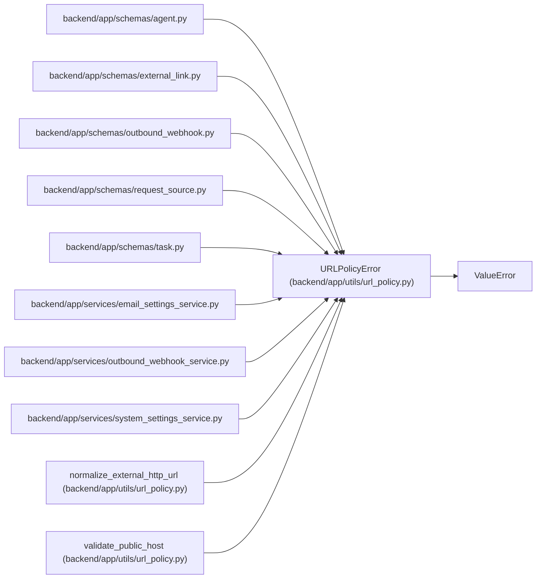

# URLPolicyError

**Location:** `backend/app/utils/url_policy.py:14`
**Kind:** Class
**Bases:** `ValueError`
**Module:** [url_policy](../modules/url_policy.md)

## Description

Raised when a URL or host violates outbound egress policy.

## Attributes

*No annotated attributes found.*

## Methods

*No public methods. Inherits from base classes.*

## Relationships

<!-- Auto-generated relationship summary. Do not edit by hand. -->

### Summary

| Module | Methods | Attributes |
|---|---:|---|
| [url_policy](../modules/url_policy.md) | 0 | — |

### Structure

| Kind | Entity | Module |
|---|---|---|
| Base | `ValueError` | — |

### References

| Reference | Kind | Source | Call sites |
|---|---|---|---:|
| `agent` | import | [schemas_agent](../modules/schemas_agent.md) | — |
| `external_link` | import | [schemas_external_link](../modules/schemas_external_link.md) | — |
| `outbound_webhook` | import | [schemas_outbound_webhook](../modules/schemas_outbound_webhook.md) | — |
| `request_source` | import | [schemas_request_source](../modules/schemas_request_source.md) | — |
| `task` | import | [schemas_task](../modules/schemas_task.md) | — |
| `email_settings_service` | import | [email_settings_service](../modules/email_settings_service.md) | — |
| `outbound_webhook_service` | import | [outbound_webhook_service](../modules/outbound_webhook_service.md) | — |
| `system_settings_service` | import | [system_settings_service](../modules/system_settings_service.md) | — |
| `normalize_external_http_url` | call | [url_policy](../modules/url_policy.md) | 4 |
| `validate_public_host` | call | [url_policy](../modules/url_policy.md) | 6 |
