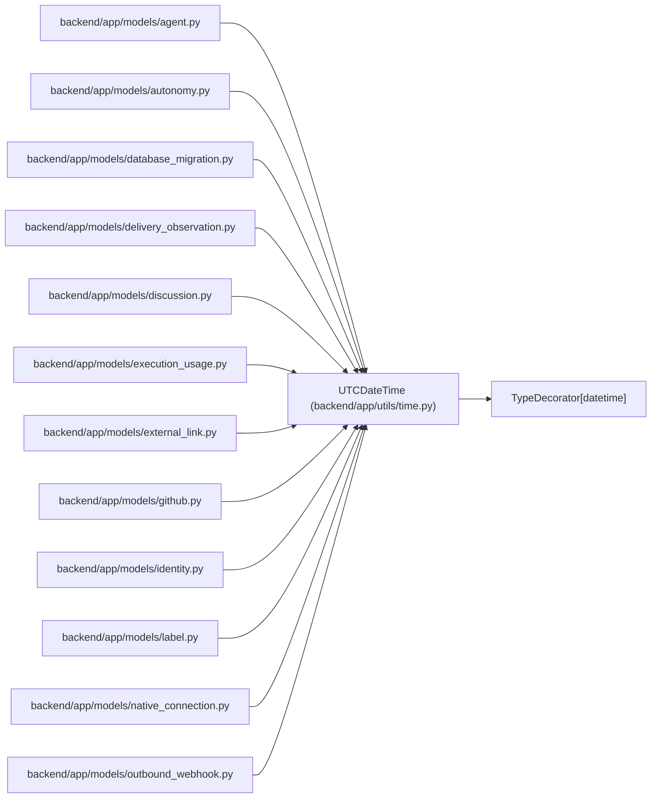

# UTCDateTime

**Location:** `backend/app/utils/time.py:28`
**Kind:** Class
**Bases:** `TypeDecorator[datetime]`
**Module:** [time](../modules/time.md)

## Description

Persist UTC datetimes and always return aware UTC values.

SQLite drops timezone offsets from its datetime representation, so values
are stored there as naive UTC and normalized on read. Dialects with native
timezone support receive aware UTC values and a timezone-aware column type.

## Attributes

*No annotated attributes found.*

## Methods

| Method | Signature | Decorators | Description |
|--------|-----------|------------|-------------|
| `load_dialect_impl` | `(dialect: Dialect) -> Any` | — | — |
| `process_bind_param` | `(value: datetime \| None, dialect: Dialect) -> datetime \| None` | — | — |
| `process_result_value` | `(value: datetime \| None, _dialect: Dialect) -> datetime \| None` | — | — |

## Relationships

<!-- Auto-generated relationship summary. Do not edit by hand. -->

### Summary

| Module | Methods | Attributes |
|---|---:|---|
| [time](../modules/time.md) | 3 | — |

### Structure

| Kind | Entity | Module |
|---|---|---|
| Base | `TypeDecorator[datetime]` | — |

### References

| Reference | Kind | Source | Call sites |
|---|---|---|---:|
| `agent` | import | [models_agent](../modules/models_agent.md) | — |
| `autonomy` | import | [models_autonomy](../modules/models_autonomy.md) | — |
| `database_migration` | import | [models_database_migration](../modules/models_database_migration.md) | — |
| `delivery_observation` | import | [delivery_observation](../modules/delivery_observation.md) | — |
| `discussion` | import | [models_discussion](../modules/models_discussion.md) | — |
| `execution_usage` | import | [models_execution_usage](../modules/models_execution_usage.md) | — |
| `external_link` | import | [models_external_link](../modules/models_external_link.md) | — |
| `github` | import | [models_github](../modules/models_github.md) | — |
| `identity` | import | [models_identity](../modules/models_identity.md) | — |
| `label` | import | [models_label](../modules/models_label.md) | — |
| `native_connection` | import | [native_connection](../modules/native_connection.md) | — |
| `outbound_webhook` | import | [models_outbound_webhook](../modules/models_outbound_webhook.md) | — |

> References: showing 12 of 27 logical references; 15 omitted by the 12-row generated summary limit.
