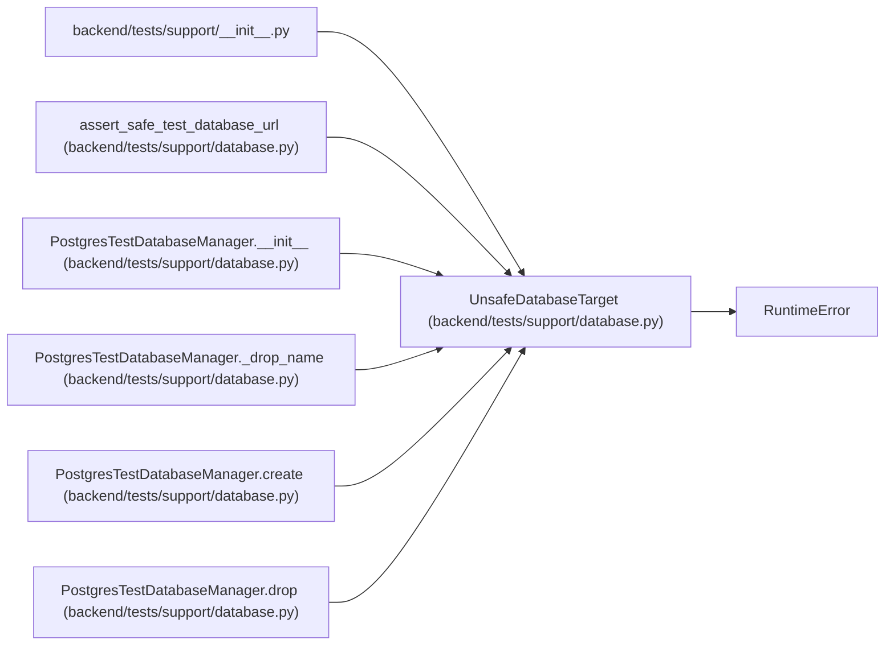

# UnsafeDatabaseTarget

**Location:** `backend/tests/support/database.py:27`
**Kind:** Class
**Bases:** `RuntimeError`
**Module:** [support_database](../modules/support_database.md)

## Description

Raised before a fixture could touch a non-test database target.

## Attributes

*No annotated attributes found.*

## Methods

*No public methods. Inherits from base classes.*

## Relationships

<!-- Auto-generated relationship summary. Do not edit by hand. -->

### Summary

| Module | Methods | Attributes |
|---|---:|---|
| [support_database](../modules/support_database.md) | 0 | — |

### Structure

| Kind | Entity | Module |
|---|---|---|
| Base | `RuntimeError` | — |

### References

| Reference | Kind | Source | Call sites |
|---|---|---|---:|
| `__init__` | import | [support___init__](../modules/support___init__.md) | — |
| `assert_safe_test_database_url` | call | [support_database](../modules/support_database.md) | 6 |
| `PostgresTestDatabaseManager.__init__` | call | [support_database](../modules/support_database.md) | 5 |
| `PostgresTestDatabaseManager._drop_name` | call | [support_database](../modules/support_database.md) | 1 |
| `PostgresTestDatabaseManager.create` | call | [support_database](../modules/support_database.md) | 9 |
| `PostgresTestDatabaseManager.drop` | call | [support_database](../modules/support_database.md) | 1 |
