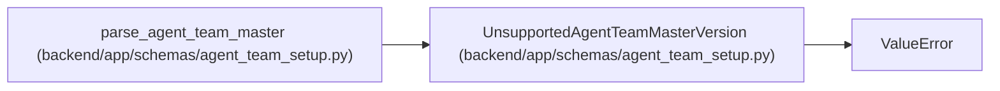

# UnsupportedAgentTeamMasterVersion

**Location:** `backend/app/schemas/agent_team_setup.py:100`
**Kind:** Class
**Bases:** `ValueError`
**Module:** [agent_team_setup](../modules/agent_team_setup.md)

## Description

Raised when a caller submits an unknown manifest schema version.

## Attributes

*No annotated attributes found.*

## Methods

*No public methods. Inherits from base classes.*

## Relationships

<!-- Auto-generated relationship summary. Do not edit by hand. -->

### Summary

| Module | Methods | Attributes |
|---|---:|---|
| [agent_team_setup](../modules/agent_team_setup.md) | 0 | — |

### Structure

| Kind | Entity | Module |
|---|---|---|
| Base | `ValueError` | — |

### References

| Reference | Kind | Source | Call sites |
|---|---|---|---:|
| `parse_agent_team_master` | call | [agent_team_setup](../modules/agent_team_setup.md) | 1 |
