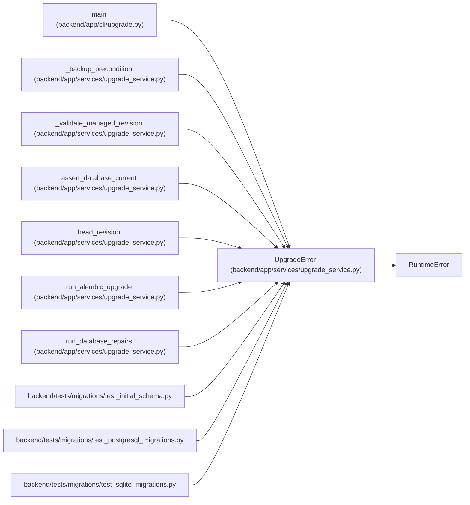

# UpgradeError

**Location:** `backend/app/services/upgrade_service.py:34`
**Kind:** Class
**Bases:** `RuntimeError`
**Module:** [upgrade_service](../modules/upgrade_service.md)

## Description

Raised when a database cannot be upgraded safely.

## Attributes

*No annotated attributes found.*

## Methods

*No public methods. Inherits from base classes.*

## Relationships

<!-- Auto-generated relationship summary. Do not edit by hand. -->

### Summary

| Module | Methods | Attributes |
|---|---:|---|
| [upgrade_service](../modules/upgrade_service.md) | 0 | — |

### Structure

| Kind | Entity | Module |
|---|---|---|
| Base | `RuntimeError` | — |

### References

| Reference | Kind | Source | Call sites |
|---|---|---|---:|
| `main` | call | [upgrade](../modules/upgrade.md) | 4 |
| `_backup_precondition` | call | [upgrade_service](../modules/upgrade_service.md) | 2 |
| `_validate_managed_revision` | call | [upgrade_service](../modules/upgrade_service.md) | 1 |
| `assert_database_current` | call | [upgrade_service](../modules/upgrade_service.md) | 1 |
| `head_revision` | call | [upgrade_service](../modules/upgrade_service.md) | 1 |
| `run_alembic_upgrade` | call | [upgrade_service](../modules/upgrade_service.md) | 4 |
| `run_database_repairs` | call | [upgrade_service](../modules/upgrade_service.md) | 1 |
| `test_initial_schema` | import | [test_initial_schema](../modules/test_initial_schema.md) | — |
| `test_postgresql_migrations` | import | [test_postgresql_migrations](../modules/test_postgresql_migrations.md) | — |
| `test_sqlite_migrations` | import | [test_sqlite_migrations](../modules/test_sqlite_migrations.md) | — |
