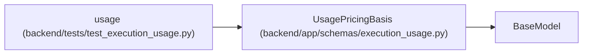

# UsagePricingBasis

**Location:** `backend/app/schemas/execution_usage.py:13`
**Kind:** Pydantic model
**Bases:** `BaseModel`
**Module:** [schemas_execution_usage](../modules/schemas_execution_usage.md)

## Description

_Auto-generated from `UsagePricingBasis` in `backend/app/schemas/execution_usage.py`._

## Model Configuration

| Setting | Value | Source |
|---------|-------|--------|
| `extra` | `'forbid'` | model_config |

## Attributes

| Name | Type | Wire name | Required | Nullable | Default | Constraints | Examples | Description |
|------|------|-----------|----------|----------|---------|-------------|-------------|----------|
| `currency` | `str` | `currency` | Yes | No | — | pattern='^[A-Z]{3}$' | — | — |
| `unit` | `str` | `unit` | Yes | No | — | min_length=1; max_length=64; pattern='^[a-z][a-z0-9_]*$' | — | — |
| `price_amount` | `Money` | `price_amount` | Yes | No | — | — | — | — |
| `price_quantity` | `Decimal` | `price_quantity` | Yes | No | — | gt=0; max_digits=18; decimal_places=6; allow_inf_nan=False | — | — |
| `version` | `str` | `version` | Yes | No | — | min_length=1; max_length=128 | — | — |
| `source` | `str` | `source` | Yes | No | — | min_length=1; max_length=500 | — | — |
| `quoted_at` | `AwareDatetime` | `quoted_at` | Yes | No | — | — | — | — |

## Methods

*No public methods. Inherits from base classes.*

## Relationships

<!-- Auto-generated relationship summary. Do not edit by hand. -->

### Summary

| Module | Methods | Attributes |
|---|---:|---|
| [schemas_execution_usage](../modules/schemas_execution_usage.md) | 0 | `currency`, `price_amount`, `price_quantity`, `quoted_at`, `source`, `unit`, `version` |

### Structure

| Kind | Entity | Module |
|---|---|---|
| Base | `BaseModel` | — |

### References

| Reference | Kind | Source | Call sites |
|---|---|---|---:|
| `usage` | call | [test_execution_usage](../modules/test_execution_usage.md) | 1 |
