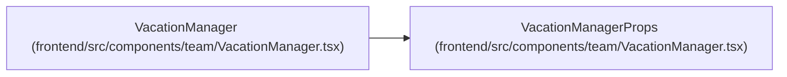

# VacationManagerProps

**Location:** `frontend/src/components/team/VacationManager.tsx:14`
**Kind:** Class
**Bases:** —
**Module:** [VacationManager](../modules/VacationManager.md)

## Description

_Auto-generated from `VacationManagerProps` in `frontend/src/components/team/VacationManager.tsx`._

## Attributes

| Name | Type | Required | Default | Description |
|------|------|----------|---------|-------------|
| `member` | `TeamMember` | Yes | — | — |
| `onClose` | `() => void` | Yes | — | — |

## Methods

*No public methods. Inherits from base classes.*

## Relationships

<!-- Auto-generated relationship summary. Do not edit by hand. -->

### Summary

| Module | Methods | Attributes |
|---|---:|---|
| [VacationManager](../modules/VacationManager.md) | 0 | `member`, `onClose` |

### References

| Reference | Kind | Source | Call sites |
|---|---|---|---:|
| `VacationManager` | type_reference | [VacationManager](../modules/VacationManager.md) | — |
