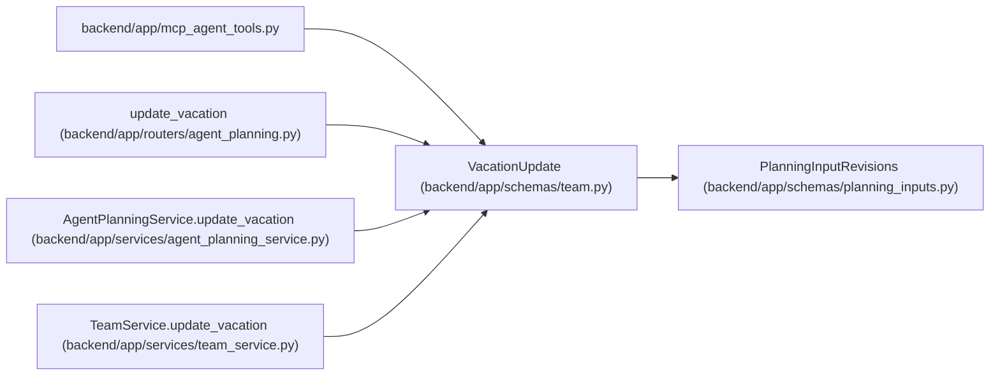

# VacationUpdate

**Location:** `backend/app/schemas/team.py:41`
**Kind:** Pydantic model
**Bases:** `PlanningInputRevisions`
**Module:** [schemas_team](../modules/schemas_team.md)

## Description

Schema for partially updating a vacation period.

## Attributes

| Name | Type | Wire name | Required | Nullable | Default | Constraints | Examples | Description |
|------|------|-----------|----------|----------|---------|-------------|-------------|----------|
| `start_date` | `Optional[date]` | `start_date` | No | Yes | `None` | — | — | — |
| `end_date` | `Optional[date]` | `end_date` | No | Yes | `None` | — | — | — |

## Methods

*No public methods. Inherits from base classes.*

## Relationships

<!-- Auto-generated relationship summary. Do not edit by hand. -->

### Summary

| Module | Methods | Attributes |
|---|---:|---|
| [schemas_team](../modules/schemas_team.md) | 0 | `end_date`, `start_date` |

### Structure

| Kind | Entity | Module |
|---|---|---|
| Base | `PlanningInputRevisions` | [planning_inputs](../modules/planning_inputs.md) |

### References

| Reference | Kind | Source | Call sites |
|---|---|---|---:|
| `mcp_agent_tools` | import | [mcp_agent_tools](../modules/mcp_agent_tools.md) | — |
| `update_vacation` | type_reference | [routers_agent_planning](../modules/routers_agent_planning.md) | — |
| `AgentPlanningService.update_vacation` | type_reference | [agent_planning_service](../modules/agent_planning_service.md) | — |
| `TeamService.update_vacation` | type_reference | [team_service](../modules/team_service.md) | — |
