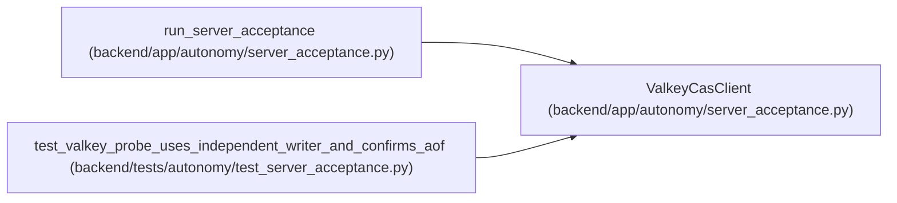

# ValkeyCasClient

**Location:** `backend/app/autonomy/server_acceptance.py:666`
**Kind:** Class
**Bases:** —
**Module:** [autonomy_server_acceptance](../modules/autonomy_server_acceptance.md)

## Description

Minimal RESP2 client for the bounded persistent CAS acceptance check.

## Attributes

*No annotated attributes found.*

## Methods

| Method | Signature | Decorators | Description |
|--------|-----------|------------|-------------|
| `__init__` | `(*, host: str, port: int, timeout_seconds: float) -> None` | — | — |
| `probe` | `(*, release_fingerprint: str, evaluated_at: datetime) -> CasAcceptance` | — | — |

## Relationships

<!-- Auto-generated relationship summary. Do not edit by hand. -->

### Summary

| Module | Methods | Attributes |
|---|---:|---|
| [autonomy_server_acceptance](../modules/autonomy_server_acceptance.md) | 2 | — |

### References

| Reference | Kind | Source | Call sites |
|---|---|---|---:|
| `run_server_acceptance` | call | [autonomy_server_acceptance](../modules/autonomy_server_acceptance.md) | 1 |
| `test_valkey_probe_uses_independent_writer_and_confirms_aof` | call | [test_server_acceptance](../modules/test_server_acceptance.md) | 1 |
