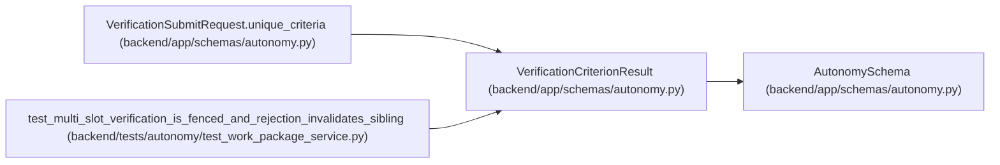

# VerificationCriterionResult

**Location:** `backend/app/schemas/autonomy.py:111`
**Kind:** Pydantic model
**Bases:** `AutonomySchema`
**Module:** [schemas_autonomy](../modules/schemas_autonomy.md)

## Description

_Auto-generated from `VerificationCriterionResult` in `backend/app/schemas/autonomy.py`._

## Attributes

| Name | Type | Wire name | Required | Nullable | Default | Constraints | Examples | Description |
|------|------|-----------|----------|----------|---------|-------------|-------------|----------|
| `criterion_id` | `str` | `criterion_id` | Yes | No | — | pattern=unknown (IDENTIFIER_PATTERN) | — | — |
| `evidence_object_digest` | `str` | `evidence_object_digest` | Yes | No | — | pattern=unknown (SHA256_PATTERN) | — | — |
| `evaluator_predicate_digest` | `str` | `evaluator_predicate_digest` | Yes | No | — | pattern=unknown (SHA256_PATTERN) | — | — |
| `outcome` | `Literal['passed', 'failed']` | `outcome` | Yes | No | — | — | — | — |

## Methods

*No public methods. Inherits from base classes.*

## Relationships

<!-- Auto-generated relationship summary. Do not edit by hand. -->

### Summary

| Module | Methods | Attributes |
|---|---:|---|
| [schemas_autonomy](../modules/schemas_autonomy.md) | 0 | `criterion_id`, `evaluator_predicate_digest`, `evidence_object_digest`, `outcome` |

### Structure

| Kind | Entity | Module |
|---|---|---|
| Base | `AutonomySchema` | [schemas_autonomy](../modules/schemas_autonomy.md) |

### References

| Reference | Kind | Source | Call sites |
|---|---|---|---:|
| `VerificationSubmitRequest.unique_criteria` | type_reference | [schemas_autonomy](../modules/schemas_autonomy.md) | — |
| `test_multi_slot_verification_is_fenced_and_rejection_invalidates_sibling` | call | [test_work_package_service](../modules/test_work_package_service.md) | 2 |
