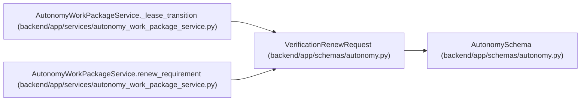

# VerificationRenewRequest

**Location:** `backend/app/schemas/autonomy.py:103`
**Kind:** Pydantic model
**Bases:** `AutonomySchema`
**Module:** [schemas_autonomy](../modules/schemas_autonomy.md)

## Description

_Auto-generated from `VerificationRenewRequest` in `backend/app/schemas/autonomy.py`._

## Attributes

| Name | Type | Wire name | Required | Nullable | Default | Constraints | Examples | Description |
|------|------|-----------|----------|----------|---------|-------------|-------------|----------|
| `requirement_id` | `int` | `requirement_id` | Yes | No | — | ge=1 | — | — |
| `expected_lease_generation` | `int` | `expected_lease_generation` | Yes | No | — | ge=1 | — | — |
| `expected_lease_digest` | `str` | `expected_lease_digest` | Yes | No | — | pattern=unknown (SHA256_PATTERN) | — | — |
| `external_journal_revision` | `int` | `external_journal_revision` | Yes | No | — | ge=1 | — | — |
| `external_journal_head_digest` | `str` | `external_journal_head_digest` | Yes | No | — | pattern=unknown (SHA256_PATTERN) | — | — |

## Methods

*No public methods. Inherits from base classes.*

## Relationships

<!-- Auto-generated relationship summary. Do not edit by hand. -->

### Summary

| Module | Methods | Attributes |
|---|---:|---|
| [schemas_autonomy](../modules/schemas_autonomy.md) | 0 | `expected_lease_digest`, `expected_lease_generation`, `external_journal_head_digest`, `external_journal_revision`, `requirement_id` |

### Structure

| Kind | Entity | Module |
|---|---|---|
| Base | `AutonomySchema` | [schemas_autonomy](../modules/schemas_autonomy.md) |

### References

| Reference | Kind | Source | Call sites |
|---|---|---|---:|
| `AutonomyWorkPackageService._lease_transition` | type_reference | [autonomy_work_package_service](../modules/autonomy_work_package_service.md) | — |
| `AutonomyWorkPackageService.renew_requirement` | type_reference | [autonomy_work_package_service](../modules/autonomy_work_package_service.md) | — |
