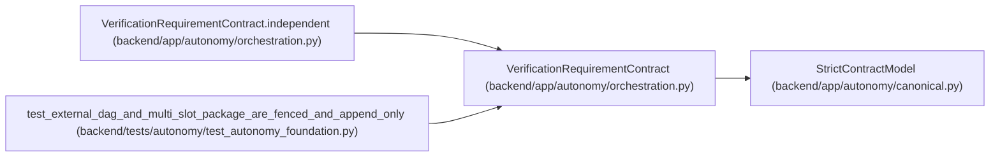

# VerificationRequirementContract

**Location:** `backend/app/autonomy/orchestration.py:423`
**Kind:** Pydantic model
**Bases:** `StrictContractModel`
**Module:** [orchestration](../modules/orchestration.md)

## Description

_Auto-generated from `VerificationRequirementContract` in `backend/app/autonomy/orchestration.py`._

## Validators

| Method | Scope | Fields | Mode | Options |
|--------|-------|--------|------|---------|
| `independent` | model | — | after | — |

## Attributes

| Name | Type | Wire name | Required | Nullable | Default | Constraints | Examples | Description |
|------|------|-----------|----------|----------|---------|-------------|-------------|----------|
| `slot_id` | `str` | `slot_id` | Yes | No | — | pattern=unknown (IDENTIFIER_PATTERN) | — | — |
| `verifier_logical_key` | `str` | `verifier_logical_key` | Yes | No | — | pattern=unknown (IDENTIFIER_PATTERN) | — | — |
| `criterion_schema` | `str` | `criterion_schema` | Yes | No | — | pattern=unknown (IDENTIFIER_PATTERN) | — | — |
| `artifact_set_digest` | `str` | `artifact_set_digest` | Yes | No | — | pattern=unknown (SHA256_PATTERN) | — | — |
| `evaluator_version` | `str` | `evaluator_version` | Yes | No | — | min_length=1; max_length=255 | — | — |
| `executor_independence_group` | `str` | `executor_independence_group` | Yes | No | — | pattern=unknown (IDENTIFIER_PATTERN) | — | — |
| `required_verifier_independence_group` | `str` | `required_verifier_independence_group` | Yes | No | — | pattern=unknown (IDENTIFIER_PATTERN) | — | — |
| `maximum_lease_seconds` | `int` | `maximum_lease_seconds` | Yes | No | — | ge=1; le=3600 | — | — |

## Methods

| Method | Signature | Decorators | Description |
|--------|-----------|------------|-------------|
| `independent` | `() -> 'VerificationRequirementContract'` | `@model_validator(mode='after')` | — |

## Relationships

<!-- Auto-generated relationship summary. Do not edit by hand. -->

### Summary

| Module | Methods | Attributes |
|---|---:|---|
| [orchestration](../modules/orchestration.md) | 1 | `artifact_set_digest`, `criterion_schema`, `evaluator_version`, `executor_independence_group`, `maximum_lease_seconds`, `required_verifier_independence_group`, `slot_id`, `verifier_logical_key` |

### Structure

| Kind | Entity | Module |
|---|---|---|
| Base | `StrictContractModel` | [autonomy_canonical](../modules/autonomy_canonical.md) |

### References

| Reference | Kind | Source | Call sites |
|---|---|---|---:|
| `VerificationRequirementContract.independent` | type_reference | [orchestration](../modules/orchestration.md) | — |
| `test_external_dag_and_multi_slot_package_are_fenced_and_append_only` | call | [test_autonomy_foundation](../modules/test_autonomy_foundation.md) | 2 |
