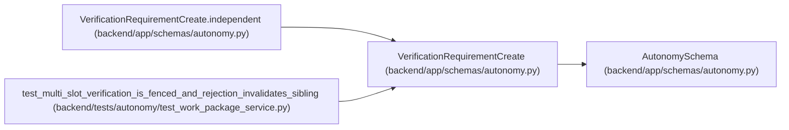

# VerificationRequirementCreate

**Location:** `backend/app/schemas/autonomy.py:19`
**Kind:** Pydantic model
**Bases:** `AutonomySchema`
**Module:** [schemas_autonomy](../modules/schemas_autonomy.md)

## Description

_Auto-generated from `VerificationRequirementCreate` in `backend/app/schemas/autonomy.py`._

## Validators

| Method | Scope | Fields | Mode | Options |
|--------|-------|--------|------|---------|
| `independent` | model | — | after | — |

## Attributes

| Name | Type | Wire name | Required | Nullable | Default | Constraints | Examples | Description |
|------|------|-----------|----------|----------|---------|-------------|-------------|----------|
| `slot_key` | `str` | `slot_key` | Yes | No | — | pattern=unknown (IDENTIFIER_PATTERN) | — | — |
| `verifier_logical_key` | `str` | `verifier_logical_key` | Yes | No | — | pattern=unknown (IDENTIFIER_PATTERN) | — | — |
| `criterion_schema` | `str` | `criterion_schema` | Yes | No | — | pattern=unknown (IDENTIFIER_PATTERN) | — | — |
| `evaluator_version` | `str` | `evaluator_version` | Yes | No | — | max_length=255; min_length=1 | — | — |
| `executor_independence_group` | `str` | `executor_independence_group` | Yes | No | — | pattern=unknown (IDENTIFIER_PATTERN) | — | — |
| `verifier_independence_group` | `str` | `verifier_independence_group` | Yes | No | — | pattern=unknown (IDENTIFIER_PATTERN) | — | — |

## Methods

| Method | Signature | Decorators | Description |
|--------|-----------|------------|-------------|
| `independent` | `() -> 'VerificationRequirementCreate'` | `@model_validator(mode='after')` | — |

## Relationships

<!-- Auto-generated relationship summary. Do not edit by hand. -->

### Summary

| Module | Methods | Attributes |
|---|---:|---|
| [schemas_autonomy](../modules/schemas_autonomy.md) | 1 | `criterion_schema`, `evaluator_version`, `executor_independence_group`, `slot_key`, `verifier_independence_group`, `verifier_logical_key` |

### Structure

| Kind | Entity | Module |
|---|---|---|
| Base | `AutonomySchema` | [schemas_autonomy](../modules/schemas_autonomy.md) |

### References

| Reference | Kind | Source | Call sites |
|---|---|---|---:|
| `VerificationRequirementCreate.independent` | type_reference | [schemas_autonomy](../modules/schemas_autonomy.md) | — |
| `test_multi_slot_verification_is_fenced_and_rejection_invalidates_sibling` | call | [test_work_package_service](../modules/test_work_package_service.md) | 2 |
