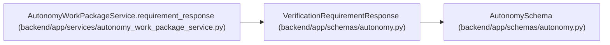

# VerificationRequirementResponse

**Location:** `backend/app/schemas/autonomy.py:141`
**Kind:** Pydantic model
**Bases:** `AutonomySchema`
**Module:** [schemas_autonomy](../modules/schemas_autonomy.md)

## Description

_Auto-generated from `VerificationRequirementResponse` in `backend/app/schemas/autonomy.py`._

## Model Configuration

| Setting | Value | Source |
|---------|-------|--------|
| `from_attributes` | `True` | model_config |
| `extra` | `'forbid'` | model_config |

## Attributes

| Name | Type | Wire name | Required | Nullable | Default | Constraints | Examples | Description |
|------|------|-----------|----------|----------|---------|-------------|-------------|----------|
| `id` | `int` | `id` | Yes | No | — | — | — | — |
| `package_id` | `int` | `package_id` | Yes | No | — | — | — | — |
| `slot_key` | `str` | `slot_key` | Yes | No | — | — | — | — |
| `verifier_logical_key` | `str` | `verifier_logical_key` | Yes | No | — | — | — | — |
| `state` | `str` | `state` | Yes | No | — | — | — | — |
| `assigned_verifier_actor_id` | `int \| None` | `assigned_verifier_actor_id` | Yes | Yes | — | — | — | — |
| `criterion_schema` | `str` | `criterion_schema` | Yes | No | — | — | — | — |
| `artifact_set_digest` | `str` | `artifact_set_digest` | Yes | No | — | — | — | — |
| `evaluator_version` | `str` | `evaluator_version` | Yes | No | — | — | — | — |
| `executor_independence_group` | `str` | `executor_independence_group` | Yes | No | — | — | — | — |
| `verifier_independence_group` | `str` | `verifier_independence_group` | Yes | No | — | — | — | — |
| `lease_generation` | `int` | `lease_generation` | Yes | No | — | — | — | — |
| `lease_digest` | `str \| None` | `lease_digest` | Yes | Yes | — | — | — | — |
| `attempt_start_digest` | `str \| None` | `attempt_start_digest` | Yes | Yes | — | — | — | — |
| `lease_expires_at` | `datetime \| None` | `lease_expires_at` | Yes | Yes | — | — | — | — |
| `heartbeat_at` | `datetime \| None` | `heartbeat_at` | Yes | Yes | — | — | — | — |
| `evidence_digest` | `str \| None` | `evidence_digest` | Yes | Yes | — | — | — | — |
| `verdict_digest` | `str \| None` | `verdict_digest` | Yes | Yes | — | — | — | — |
| `created_at` | `datetime` | `created_at` | Yes | No | — | — | — | — |
| `updated_at` | `datetime` | `updated_at` | Yes | No | — | — | — | — |

## Methods

*No public methods. Inherits from base classes.*

## Relationships

<!-- Auto-generated relationship summary. Do not edit by hand. -->

### Summary

| Module | Methods | Attributes |
|---|---:|---|
| [schemas_autonomy](../modules/schemas_autonomy.md) | 0 | `artifact_set_digest`, `assigned_verifier_actor_id`, `attempt_start_digest`, `created_at`, `criterion_schema`, `evaluator_version`, `evidence_digest`, `executor_independence_group`, `heartbeat_at`, `id`, `lease_digest`, `lease_expires_at` |

### Structure

| Kind | Entity | Module |
|---|---|---|
| Base | `AutonomySchema` | [schemas_autonomy](../modules/schemas_autonomy.md) |

### References

| Reference | Kind | Source | Call sites |
|---|---|---|---:|
| `AutonomyWorkPackageService.requirement_response` | type_reference | [autonomy_work_package_service](../modules/autonomy_work_package_service.md) | — |
