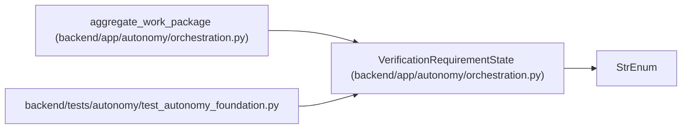

# VerificationRequirementState

**Location:** `backend/app/autonomy/orchestration.py:413`
**Kind:** Enum
**Bases:** `StrEnum`
**Module:** [orchestration](../modules/orchestration.md)

## Description

_Auto-generated from `VerificationRequirementState` in `backend/app/autonomy/orchestration.py`._

## Attributes

| Name | Declared value | Description |
|------|-------|-------------|
| `PLANNED` | `'planned'` | — |
| `READY` | `'ready'` | — |
| `CLAIMED` | `'claimed'` | — |
| `RUNNING` | `'running'` | — |
| `PASSED` | `'passed'` | — |
| `REJECTED` | `'rejected'` | — |
| `EXPIRED` | `'expired'` | — |

## Methods

*No public methods. Inherits from base classes.*

## Relationships

<!-- Auto-generated relationship summary. Do not edit by hand. -->

### Summary

| Module | Methods | Attributes |
|---|---:|---|
| [orchestration](../modules/orchestration.md) | 0 | `CLAIMED`, `EXPIRED`, `PASSED`, `PLANNED`, `READY`, `REJECTED`, `RUNNING` |

### Structure

| Kind | Entity | Module |
|---|---|---|
| Base | `StrEnum` | — |

### References

| Reference | Kind | Source | Call sites |
|---|---|---|---:|
| `aggregate_work_package` | type_reference | [orchestration](../modules/orchestration.md) | — |
| `test_autonomy_foundation` | import | [test_autonomy_foundation](../modules/test_autonomy_foundation.md) | — |
