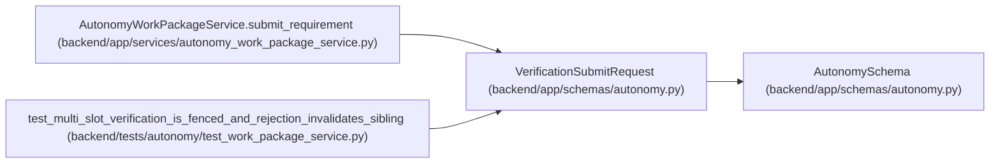

# VerificationSubmitRequest

**Location:** `backend/app/schemas/autonomy.py:118`
**Kind:** Pydantic model
**Bases:** `AutonomySchema`
**Module:** [schemas_autonomy](../modules/schemas_autonomy.md)

## Description

_Auto-generated from `VerificationSubmitRequest` in `backend/app/schemas/autonomy.py`._

## Validators

| Method | Scope | Fields | Mode | Options |
|--------|-------|--------|------|---------|
| `unique_criteria` | field | criterion_results | after | — |

## Attributes

| Name | Type | Wire name | Required | Nullable | Default | Constraints | Examples | Description |
|------|------|-----------|----------|----------|---------|-------------|-------------|----------|
| `requirement_id` | `int` | `requirement_id` | Yes | No | — | ge=1 | — | — |
| `expected_lease_generation` | `int` | `expected_lease_generation` | Yes | No | — | ge=1 | — | — |
| `expected_lease_digest` | `str` | `expected_lease_digest` | Yes | No | — | pattern=unknown (SHA256_PATTERN) | — | — |
| `artifact_set_digest` | `str` | `artifact_set_digest` | Yes | No | — | pattern=unknown (SHA256_PATTERN) | — | — |
| `criterion_results` | `tuple[VerificationCriterionResult, ...]` | `criterion_results` | Yes | No | — | min_length=1; max_length=512 | — | — |
| `evaluator_attestation_digest` | `str` | `evaluator_attestation_digest` | Yes | No | — | pattern=unknown (SHA256_PATTERN) | — | — |
| `external_journal_revision` | `int` | `external_journal_revision` | Yes | No | — | ge=1 | — | — |
| `external_journal_head_digest` | `str` | `external_journal_head_digest` | Yes | No | — | pattern=unknown (SHA256_PATTERN) | — | — |

## Methods

| Method | Signature | Decorators | Description |
|--------|-----------|------------|-------------|
| `unique_criteria` | `(value: tuple[VerificationCriterionResult, ...]) -> tuple[VerificationCriterionResult, ...]` | `@field_validator('criterion_results')`, `@classmethod` | — |

## Relationships

<!-- Auto-generated relationship summary. Do not edit by hand. -->

### Summary

| Module | Methods | Attributes |
|---|---:|---|
| [schemas_autonomy](../modules/schemas_autonomy.md) | 1 | `artifact_set_digest`, `criterion_results`, `evaluator_attestation_digest`, `expected_lease_digest`, `expected_lease_generation`, `external_journal_head_digest`, `external_journal_revision`, `requirement_id` |

### Structure

| Kind | Entity | Module |
|---|---|---|
| Base | `AutonomySchema` | [schemas_autonomy](../modules/schemas_autonomy.md) |

### References

| Reference | Kind | Source | Call sites |
|---|---|---|---:|
| `AutonomyWorkPackageService.submit_requirement` | type_reference | [autonomy_work_package_service](../modules/autonomy_work_package_service.md) | — |
| `test_multi_slot_verification_is_fenced_and_rejection_invalidates_sibling` | call | [test_work_package_service](../modules/test_work_package_service.md) | 2 |
