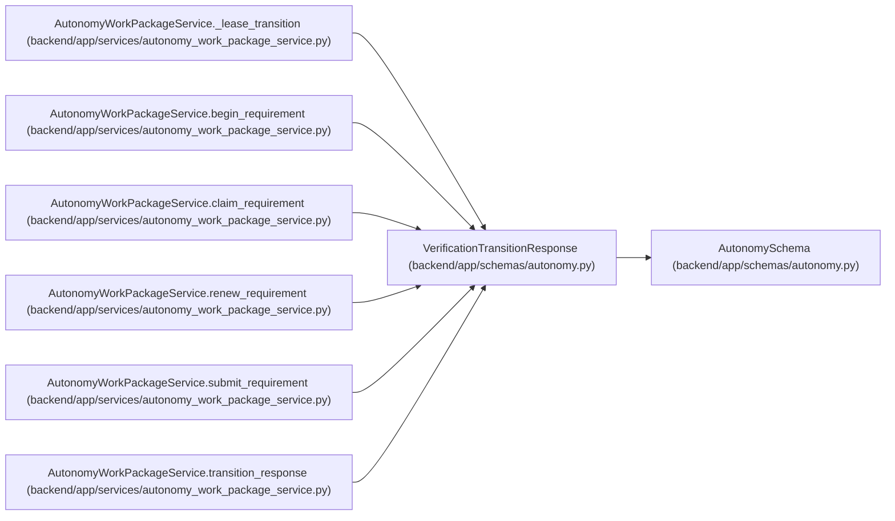

# VerificationTransitionResponse

**Location:** `backend/app/schemas/autonomy.py:185`
**Kind:** Pydantic model
**Bases:** `AutonomySchema`
**Module:** [schemas_autonomy](../modules/schemas_autonomy.md)

## Description

_Auto-generated from `VerificationTransitionResponse` in `backend/app/schemas/autonomy.py`._

## Attributes

| Name | Type | Wire name | Required | Nullable | Default | Constraints | Examples | Description |
|------|------|-----------|----------|----------|---------|-------------|-------------|----------|
| `requirement` | `VerificationRequirementResponse` | `requirement` | Yes | No | — | — | — | — |
| `package_state` | `Literal['planned', 'evaluating', 'passed', 'rework_required']` | `package_state` | Yes | No | — | — | — | — |
| `verdict` | `Literal['passed', 'rejected'] \| None` | `verdict` | No | Yes | `None` | — | — | — |

## Methods

*No public methods. Inherits from base classes.*

## Relationships

<!-- Auto-generated relationship summary. Do not edit by hand. -->

### Summary

| Module | Methods | Attributes |
|---|---:|---|
| [schemas_autonomy](../modules/schemas_autonomy.md) | 0 | `package_state`, `requirement`, `verdict` |

### Structure

| Kind | Entity | Module |
|---|---|---|
| Base | `AutonomySchema` | [schemas_autonomy](../modules/schemas_autonomy.md) |

### References

| Reference | Kind | Source | Call sites |
|---|---|---|---:|
| `AutonomyWorkPackageService._lease_transition` | type_reference | [autonomy_work_package_service](../modules/autonomy_work_package_service.md) | — |
| `AutonomyWorkPackageService.begin_requirement` | type_reference | [autonomy_work_package_service](../modules/autonomy_work_package_service.md) | — |
| `AutonomyWorkPackageService.claim_requirement` | type_reference | [autonomy_work_package_service](../modules/autonomy_work_package_service.md) | — |
| `AutonomyWorkPackageService.renew_requirement` | type_reference | [autonomy_work_package_service](../modules/autonomy_work_package_service.md) | — |
| `AutonomyWorkPackageService.submit_requirement` | type_reference | [autonomy_work_package_service](../modules/autonomy_work_package_service.md) | — |
| `AutonomyWorkPackageService.transition_response` | call | [autonomy_work_package_service](../modules/autonomy_work_package_service.md) | 1 |
| `AutonomyWorkPackageService.transition_response` | type_reference | [autonomy_work_package_service](../modules/autonomy_work_package_service.md) | — |
