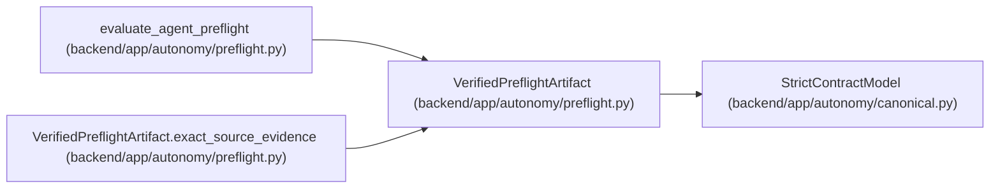

# VerifiedPreflightArtifact

**Location:** `backend/app/autonomy/preflight.py:65`
**Kind:** Pydantic model
**Bases:** `StrictContractModel`
**Module:** [preflight](../modules/preflight.md)

## Description

_Auto-generated from `VerifiedPreflightArtifact` in `backend/app/autonomy/preflight.py`._

## Validators

| Method | Scope | Fields | Mode | Options |
|--------|-------|--------|------|---------|
| `exact_source_evidence` | model | — | after | — |

## Attributes

| Name | Type | Wire name | Required | Nullable | Default | Constraints | Examples | Description |
|------|------|-----------|----------|----------|---------|-------------|-------------|----------|
| `predicate_id` | `str` | `predicate_id` | Yes | No | — | pattern=unknown (IDENTIFIER_PATTERN) | — | — |
| `evidence_kind` | `str` | `evidence_kind` | Yes | No | — | pattern=unknown (IDENTIFIER_PATTERN) | — | — |
| `object_digest` | `str` | `object_digest` | Yes | No | — | pattern=unknown (SHA256_PATTERN) | — | — |
| `signed_evidence` | `SignedAutonomousEvidence` | `signed_evidence` | Yes | No | — | — | — | — |

## Methods

| Method | Signature | Decorators | Description |
|--------|-----------|------------|-------------|
| `exact_source_evidence` | `() -> 'VerifiedPreflightArtifact'` | `@model_validator(mode='after')` | — |

## Relationships

<!-- Auto-generated relationship summary. Do not edit by hand. -->

### Summary

| Module | Methods | Attributes |
|---|---:|---|
| [preflight](../modules/preflight.md) | 1 | `evidence_kind`, `object_digest`, `predicate_id`, `signed_evidence` |

### Structure

| Kind | Entity | Module |
|---|---|---|
| Base | `StrictContractModel` | [autonomy_canonical](../modules/autonomy_canonical.md) |

### References

| Reference | Kind | Source | Call sites |
|---|---|---|---:|
| `evaluate_agent_preflight` | type_reference | [preflight](../modules/preflight.md) | — |
| `VerifiedPreflightArtifact.exact_source_evidence` | type_reference | [preflight](../modules/preflight.md) | — |
