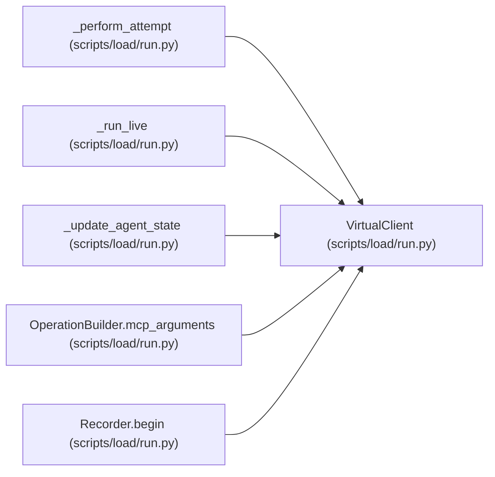

# VirtualClient

**Location:** `scripts/load/run.py:568`
**Kind:** Class
**Bases:** —
**Module:** [run](../modules/run.md)

## Description

_Auto-generated from `VirtualClient` in `scripts/load/run.py`._

## Attributes

*No annotated attributes found.*

## Methods

| Method | Signature | Decorators | Description |
|--------|-----------|------------|-------------|
| `__init__` | `(*, kind: str, credential: Mapping[str, Any], base_url: str, cookie_name: str, timeout: float, actor_count: int, assignment_capacity: int) -> None` | — | — |
| `open` | *(async)* `(mcp_url: str) -> None` | — | — |
| `close` | *(async)* `() -> None` | — | — |
| `open_connection_count` | `() -> int` | — | — |
| `set_poll_guidance` | `(value: str) -> bool` | — | Parse one server deadline and arm the next get-work poll. |

## Relationships

<!-- Auto-generated relationship summary. Do not edit by hand. -->

### Summary

| Module | Methods | Attributes |
|---|---:|---|
| [run](../modules/run.md) | 5 | — |

### References

| Reference | Kind | Source | Call sites |
|---|---|---|---:|
| `_perform_attempt` | type_reference | [run](../modules/run.md) | — |
| `_run_live` | call | [run](../modules/run.md) | 2 |
| `_update_agent_state` | type_reference | [run](../modules/run.md) | — |
| `OperationBuilder.mcp_arguments` | type_reference | [run](../modules/run.md) | — |
| `Recorder.begin` | type_reference | [run](../modules/run.md) | — |
