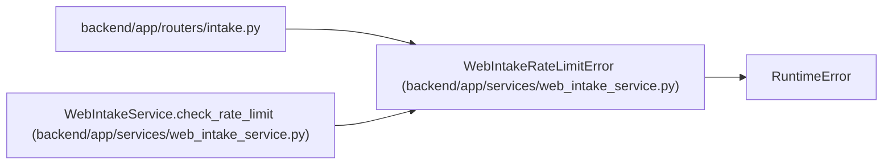

# WebIntakeRateLimitError

**Location:** `backend/app/services/web_intake_service.py:25`
**Kind:** Class
**Bases:** `RuntimeError`
**Module:** [web_intake_service](../modules/web_intake_service.md)

## Description

Raised when an intake requester exceeds the configured rate limit.

## Attributes

*No annotated attributes found.*

## Methods

| Method | Signature | Decorators | Description |
|--------|-----------|------------|-------------|
| `__init__` | `(retry_after_seconds: int, limit: int, client_ip: str)` | — | — |

## Relationships

<!-- Auto-generated relationship summary. Do not edit by hand. -->

### Summary

| Module | Methods | Attributes |
|---|---:|---|
| [web_intake_service](../modules/web_intake_service.md) | 1 | — |

### Structure

| Kind | Entity | Module |
|---|---|---|
| Base | `RuntimeError` | — |

### References

| Reference | Kind | Source | Call sites |
|---|---|---|---:|
| `intake` | import | [routers_intake](../modules/routers_intake.md) | — |
| `WebIntakeService.check_rate_limit` | call | [web_intake_service](../modules/web_intake_service.md) | 1 |
